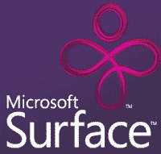
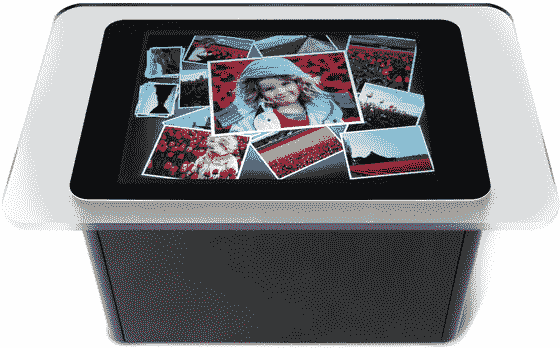
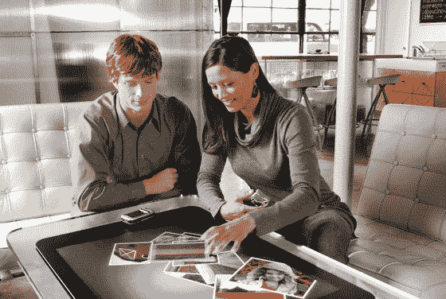

# 微软发布 Surface 电脑| TechCrunch

> 原文：<https://web.archive.org/web/http://www.techcrunch.com/2007/05/29/microsoft-announces-surface-computer/http://www.techcrunch.com/2007/05/29/microsoft-announces-surface-computer/>

# 微软宣布推出 Surface 电脑

 在周三的 D: All Things Digital 大会上，微软首席执行官史蒂夫·鲍尔默(Steve Ballmer)将推出[微软 Surface](https://web.archive.org/web/20130115010211/http://www.microsoft.com/surface/) ，这是微软第一款新类别的 Surface 计算产品，将“打破人与技术之间的传统壁垒”。

表面计算机能够识别从画笔到手机的物理对象，并允许对照片、音乐和地图等内容进行直接控制。Surface 将一个普通的桌面变成了一个动态的表面，通过自然的手势、触摸和物理对象来提供与所有形式的数字内容的交互。

新产品直接面向酒店、零售机构、餐馆和公共娱乐场所，将于年底上市。

这是一个有趣的产品，因为它完全不属于任何领域。微软给出了一些例子，比如吃饭时用手指轻轻一点就可以点饮料，用手指在屏幕上移动就可以快速浏览音乐，并将喜欢的歌曲拖到个人播放列表中。把它建成一个酒吧，你就可以得到一键式啤酒服务，尽管我不确定他们是否已经找到了一种方法来计算出你的啤酒杯什么时候空了，所以补充会变得自动，也许在以后的版本中。

Surface 在销售点的实际用途非常广泛。这是触摸屏销售点技术在一个新的水平。

最初的合作伙伴包括 Harrah's Entertainment、喜达屋酒店和 T-Mobile。在嘎吱齿轮[这里](https://web.archive.org/web/20130115010211/http://crunchgear.com/2007/05/30/microsoft-mystery-solved-its-surface/)报道。

更新:第 10 频道有一个很棒的视频[在这里](https://web.archive.org/web/20130115010211/http://on10.net/Blogs/larry/first-look-microsoft-surfacing-computing/)。

[http://admin.brightcove.com/destination/player/player.swf](https://web.archive.org/web/20130115010211/http://admin.brightcove.com/destination/player/player.swf)
