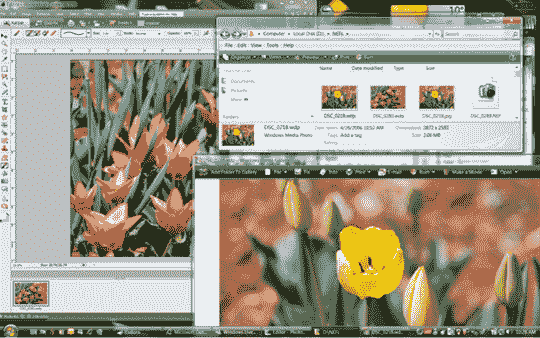

# 微软试图超越 JPEG，即将实现| TechCrunch

> 原文：<https://web.archive.org/web/http://techcrunch.com/2007/08/01/microsoft-attempts-to-overtake-jpeg-almost-there/>

微软的高清照片文件格式离被 JPEG 接受又近了一步。高清照片或 JPEG XR 的标准化将确保软件、显示器、打印机和相机公司能够在一致的基础上开发产品，并确保所有产品和平台的互操作性。

由微软核心媒体处理团队开发的 HD Photo 将专注于数码摄影的当前和未来需求。Vista 用户已经熟悉了端到端的数码摄影格式，我相信他们会告诉你更好的图像保真度，更高的图像压缩效率和适应性更强的编辑功能。新标准的最终确定和发布需要长达一年的时间，所以不要指望在明年第四季度之前看到 JPEG XR，如果它能走到那一步的话。

[微软的高清照片技术被 JPEG 认为是标准化的](https://web.archive.org/web/20160422050953/http://money.cnn.com/news/newsfeeds/articles/prnewswire/AQTU10231072007-1.htm)【CNN】