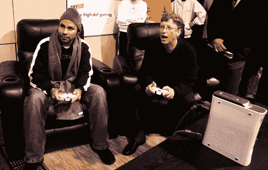

# 微软证实 Xbox 360 降价:Premium 现在便宜 50 美元

> 原文：<https://web.archive.org/web/http://techcrunch.com/2007/08/07/microsoft-confirms-xbox-360-price-cut-premium-now-50-cheaper/>

微软降低了 Xbox 360 的价格，结束了几个月的闲置猜测。高级 SKU 的价格下降了 50 美元至 350 美元，核心降低了 20 美元至 280 美元，精英降低了 30 美元至 450 美元。所有降价将于明天，8 月 8 日生效。

这一次，谣言被证明是真的。彼得提到的[电路城广告](https://web.archive.org/web/20160422062714/http://crunchgear.com/2007/07/31/circuit-city-ad-confirms-price-cuts-for-all-xbox-360-systems/)非常准确，准确预测了官方降价。

至于为什么雷德蒙决定大幅降低系统价格，正如你所料:假期临近，想要接触新的(不太富裕的)观众，等等。尽管这让索尼陷入了拥有最昂贵游戏机的尴尬境地。

想象一位不知情的母亲走进百思买或沃尔玛:我应该给我儿子买一台[500 美元的系统](https://web.archive.org/web/20160422062714/http://crunchgear.com/category/ps3/)、一台[350 美元的系统](https://web.archive.org/web/20160422062714/http://crunchgear.com/category/xbox-360/)还是一台[250 美元的系统](https://web.archive.org/web/20160422062714/http://crunchgear.com/category/wii/)？

我记得那些日子，我的父亲因为整天工作而感到内疚，他会给我买所有现有的系统。美好时光。

[微软将下调 Xbox 360 游戏机价格](https://web.archive.org/web/20160422062714/http://today.reuters.com/news/articlenews.aspx?type=technologyNews&storyID=2007-08-07T051947Z_01_N06442268_RTRUKOC_0_US-MICROSOFT-XBOX360.xml&pageNumber=0&imageid=&cap=&sz=13&WTModLoc=NewsArt-C1-ArticlePage2)[路透社]