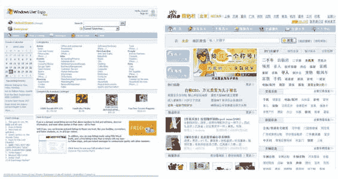

# 微软指责被盗界面 TechCrunch

> 原文：<https://web.archive.org/web/http://www.techcrunch.com/2006/09/01/microsoft-cries-foul-at-stolen-interface/>

# 微软对被盗界面叫屈

  微软[世博会](https://web.archive.org/web/20220929201121/http://expo.live.com/)项目负责人盖瑞·怀斯曼今天早些时候写了一篇[博文](https://web.archive.org/web/20220929201121/http://teamexpo.spaces.live.com/blog/cns!ED26394D7E8C131B!363.entry)批评中国最大的搜索引擎之一新浪，称“新浪窃取了我们的设计和图片”。

这篇文章强调了新浪的新分类网站[与之前发布的 Expo 的外观和感觉相似，包括相同的配色方案和一个图钉图像，看起来像是被偷了:](https://web.archive.org/web/20220929201121/http://post.sina.com.cn/v3_index.php)

> Sina.com 窃取了我们的设计和图片(感谢 Phillipe 在我们博客上的评论),我们最近得知中国有一个新的分类网站，它不仅改进了我们以前的用户界面，还直接复制了我们的一些图片(注意我们的设计师 Becky 创作的很酷的图钉图片)。令人震惊的是，这个有问题的网站属于中国最大的搜索引擎之一 Sina.com。他们雇不起设计师吗？
> 
> 无论如何，看看我附在这篇博客上的图片吧。或者，看看我们之前的界面截图，然后访问:[http://post.sina.com.cn/v3_index.php](https://web.archive.org/web/20220929201121/http://post.sina.com.cn/v3_index.php)
> 
> 这么说吧，我很期待我们在中国的发布..
> 
> 加里

自己决定新浪是否抄袭微软——下面是并排的屏幕截图，Garry 的[帖子](https://web.archive.org/web/20220929201121/http://teamexpo.spaces.live.com/blog/cns!ED26394D7E8C131B!363.entry)上有更大的视图。肯定有相似之处，尽管有些读者不会忘记微软对一个[被盗的用户界面](https://web.archive.org/web/20220929201121/http://en.wikipedia.org/wiki/Apple_Computer,_Inc._v._Microsoft_Corp.)叫嚣犯规的讽刺。

简要说明:我非常了解 Garry，喜欢他在过去一年左右的时间里在 Expo 项目中所做的工作。我们之前的报道是[这里](https://web.archive.org/web/20220929201121/http://www.beta.techcrunch.com/2006/01/13/microsoft-expo-beta/)，这里[这里](https://web.archive.org/web/20220929201121/http://www.beta.techcrunch.com/2006/02/10/microsoft-expo-expands-beta/)，这里[这里](https://web.archive.org/web/20220929201121/http://www.beta.techcrunch.com/2006/02/28/microsoft-expo-launches/)。

