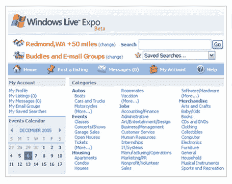

# 关于微软“Expo”测试版的更多信息 TechCrunch

> 原文：<https://web.archive.org/web/http://www.techcrunch.com:80/2006/01/13/microsoft-expo-beta/>

# 更多关于微软“Expo”测试版的信息

微软已经将它的[弗里蒙特](https://web.archive.org/web/20221002133227/http://login.passport.net/uilogin.srf?lc=1033&id=67227)项目重新命名为“Expo ”,并且已经建立了一个[登陆页面](https://web.archive.org/web/20221002133227/http://ideas.live.com/programpage.aspx?versionId=22032d98-43b2-4855-bbf0-8e1e7645b089),完成了一个发布后的电子邮件请求。他们还附上了一张截图:

由 Garry Wiseman 领导的 Expo 团队也发布了有关该服务的信息，该服务将与 MSN Messenger 和 MSN Spaces 紧密集成。列表将是免费的:

> **什么是**
> 在线市场和社交网站
>  **它能为您提供什么**
> 
> 易于发布的免费广告浏览商品、
> 活动、个人和服务等各种类别
> 将您的交易保持在一个可信的网络内，如您的 MSN Messenger 好友、朋友或同事；或者向任何人开放
> 查找您所在地区、全国或两者之间任何地方的列表
> 只需轻轻一点，即可将您的列表添加到您的 MSN 共享空间
> 获取详细的地图和路线，例如车库销售、待售房屋或音乐会
> 通过 MSN Messenger 直接从世博会的网站与人交流