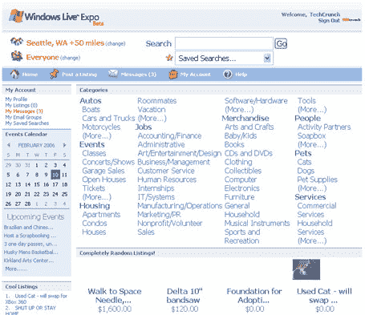
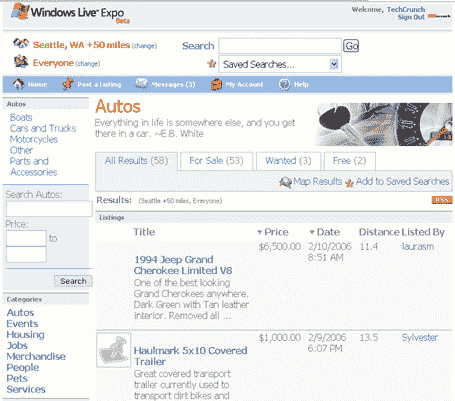
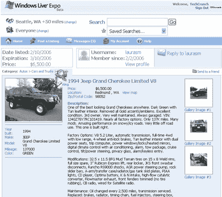
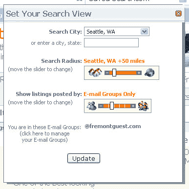

# 微软博览会扩大测试版 TechCrunch

> 原文：<https://web.archive.org/web/http://www.techcrunch.com/2006/02/10/microsoft-expo-expands-beta/>

# 微软博览会扩大测试版

微软的新分类产品，[Live.com 博览会](expo.live.com)，已经开始推出更多的测试版。

Expo 的核心理念是人们会信任群体中的其他人，因此允许群体中的分类广告网络。用户可以选择只在他们的即时通讯好友中搜索分类广告，或者在一个电子邮件组中搜索(比如任何有 boeing.com 电子邮件地址的人)，或者“所有人”。本周，他们将所有华盛顿大学的学生都加入了 Expo，这个项目的负责人 Garry Wiseman 告诉我，更多的学生正在加入进来。世博会向所有人直播的日期还没有确定。

其他截图如下。我还在我关于世博会的[上一篇文章](https://web.archive.org/web/20220926193200/http://www.beta.techcrunch.com/2006/01/13/microsoft-expo-beta/)中包含了一个基本的截屏。

