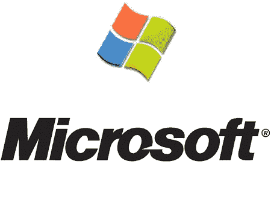

# 微软获得公司代码证书| TechCrunch

> 原文：<https://web.archive.org/web/http://techcrunch.com:80/2007/08/07/microsoft-gets-companys-code-certificate-pulled/>

最好小心编码同事。为 Windows 开发一个有用的工具，微软可能会对你穷追不舍。总部位于澳大利亚的公司 LinchpinLabs 于 7 月 20 日免费发布了 Atsiv 实用程序。它允许用户规避 64 位版本 Vista 的一个功能，该功能只允许将数字签名的代码加载到操作系统内核中。简而言之，没有 Atsiv 就不能去乱搞 64 位版本的 Vista 的内核。

微软了解了 LinchpinLabs 的实用程序，并决定不让任何人摆弄它蹩脚的新操作系统。所以微软变得狡猾起来，要求 Verisign 撤销 LinchpinLabs 的证书。现在这个软件应该不再工作了。不管怎样，这只是微软如此糟糕的另一个例子。

[微软让威瑞信吊销 Atsiv 证书](https://web.archive.org/web/20170707231141/http://www.neowin.net/index.php?act=view&id=41818)