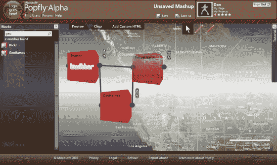

# 微软发布基于 Silverlight 的 Popfly: Mashup 应用创建器

> 原文：<https://web.archive.org/web/http://www.techcrunch.com:80/2007/05/18/microsoft-launches-popfly-mashup-app-creator-built-on-silverlight/>

# 微软发布基于 Silverlight 的 Popfly: Mashup 应用创建器

  微软将于今天上午宣布 [Popfly](https://web.archive.org/web/20220816011736/http://www.popfly.ms/) 的私人测试版发布，这是一款新的 [Silverlight](https://web.archive.org/web/20220816011736/http://www.beta.techcrunch.com/2007/05/01/take-time-to-understand-silverlight-its-important/) 应用程序，允许用户使用非常酷且易于使用的基于网络的图形界面来创建混搭、小工具和其他应用程序。我们之前报道了 Yahoo Pipes 的发布，并比较了五种不同的应用程序，它们可以让你混合数据并在线构建应用程序。当时我们提到了这个领域是如何真正升温的——以及 Yahoo 的 Pipes 如何通过提供一个拖放界面来简化混搭和迷你应用程序的创建。微软是这个市场的最新进入者，他们已经完全超越了我们迄今为止看到的所有其他应用程序。

Popfly 是上述竞争对手的一大飞跃，因为它让你做更多的事情，而且它是我见过的最好的网络应用程序界面之一。使用 Popfly，您可以创建应用程序、混搭、网页和小工具(小工具),所有这些都被捆绑在一个社交网络中(作为 Live Spaces 平台的一部分),在这里您可以与应用程序的其他用户和发布者联系。混搭是通过拖动和连接产生输出的“块”来创建的。块是连接到各种 web 服务 API 的模块，即使在今天，仍有许多不同的块用于各种不同的 web 服务。

点击此处查看 Popfly 概览页面[上的其他截屏和截屏链接。](https://web.archive.org/web/20220816011736/http://www.popfly.ms/Overview/)

看到像 Popfly 这样的应用程序从微软出来是我很久以前无法想象的事情——加上最近的 Silverlight 公告(我们也非常兴奋),新的微软真的开始通过他们的产品发布出来了。到目前为止，Popfly 似乎是雷·奥茨(Ozziesoft)领导下的新微软的又一个潜在的大热门。

**邀请**:虽然私人测试版非常有限(即使在微软内部)，但我们确实有十个邀请要发出。留下关于你将如何使用 Popfly 的评论，最好的(或最有趣的)十个将被发送到应用程序的邀请。

