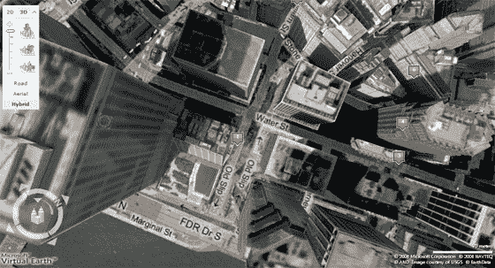
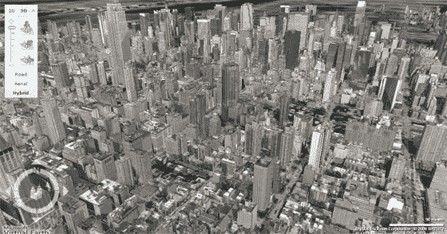

# 微软 Live 拿下纽约 3D

> 原文：<https://web.archive.org/web/http://www.techcrunch.com:80/2007/05/28/microsoft-live-takes-new-york-3d/>

# 微软 Live 拿下纽约 3D

 微软[宣布](https://web.archive.org/web/20220811104423/http://www.microsoft.com/presspass/press/2007/may07/05-28NYC3DMA.mspx)推出[微软 Live 搜索地图](https://web.archive.org/web/20220811104423/http://maps.live.com/)的新功能；覆盖纽约市和美国、英国和加拿大的其他 8 个地点的三维照片级逼真地图。

3D 服务提供了每个城市的独特外观，结合微软的位置和商业数据，提供了一种曾经被认为是科幻小说的服务。

此次发布让微软在 3D 地图领域领先谷歌一步。谷歌从斯坦福大学的一个团队获得了 3D 技术，该团队将为谷歌提供类似的功能。谷歌地图的 3D 建模目前不包括照片真实感。

纽约市的三维图像首次出现在奥斯汀、珊瑚角(佛罗里达州)、辛辛那提、印第安纳波利斯、北安普顿(英国)、渥太华、萨凡纳和坦帕。在北方夏季，全球将有更多城市加入这项服务。

第一印象:如果你不是在最高设置的高速连接上，速度会非常慢，但是电脑生成的效果是惊人的。

 

[http://www.google.com/notebook/static_files/blank.html](https://web.archive.org/web/20220811104423/http://www.google.com/notebook/static_files/blank.html)