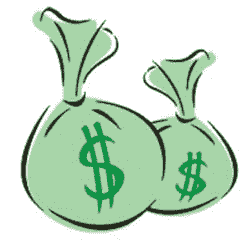

# 微软为独家 GTA IV 内容支付 5000 万美元:没有什么比砸钱解决问题更好的了

> 原文：<https://web.archive.org/web/http://techcrunch.com/2007/06/18/microsoft-pays-50-million-for-exclusive-gta-iv-content-nothing-like-throwing-money-at-a-problem/>

时间会证明微软为独家[*【GTA IV*](https://web.archive.org/web/20140311002639/http://crunchgear.com/2007/05/03/xbox-360-making-for-slow-going-of-gta-iv/)内容投入的 5000 万美元是否会带来回报。目前在互联网上流传的报告表明，微软掏空了 5000 万美元，以便 Rockstar 为 Xbox 360 版本的游戏制作独家的可下载内容。如果这是真的，那么 360 版本肯定是一个去。抱歉，索尼。

第一批可下载内容计划于 2008 年 3 月推出，第二批将于 2008 财年推出。我想当你在银行里有那么多钱的时候，你可以随意挥霍 5000 万美元。

[Take-Two f2q 07(2007 年 4 月 30 日季度末)收益电话会议记录](https://web.archive.org/web/20140311002639/http://seekingalpha.com/article/38017)【通过[寻找 Alpha 下一代](https://web.archive.org/web/20140311002639/http://www.next-gen.biz/index.php?option=com_content&task=view&id=6023&Itemid=2)