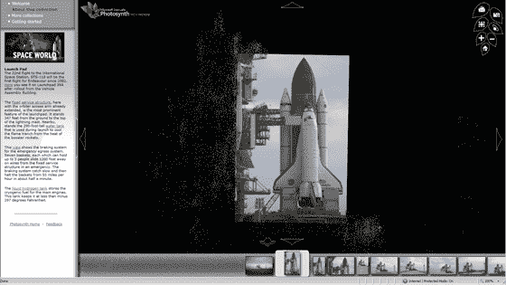

# 微软 Photosynth 报道奋进号航天飞机发射前| TechCrunch

> 原文：<https://web.archive.org/web/http://www.techcrunch.com:80/2007/08/05/microsoft-photosynth-covers-shuttle-endeavour-pre-launch/>

# 微软 Photosynth 覆盖奋进号航天飞机发射前

  我是所有围绕网络开发的 3D 成像工具的忠实粉丝。[微软的 Photosynth](https://web.archive.org/web/20230307225821/https://techcrunch.com/2006/08/01/microsoft-to-present-fly-through-photo-app-photosynth/) 项目显然是最雄心勃勃的——它拍摄了一个地理区域的数千张照片，并构建了一个 3D 模型，观众可以四处“飞行”并观看。

今晚他们将推出一个新的 3D 模型——奋进号航天飞机发射前在佛罗里达州肯尼迪航天中心发射台上的报道。如果你只在 Windows 机器上，你可以在这里查看[。点击拖动鼠标，放大缩小等。](https://web.archive.org/web/20230307225821/http://media.labs.live.com/photosynth/NASA/default.htm)

还有其他有趣的项目——参见我们对 [Everyscape](https://web.archive.org/web/20230307225821/https://techcrunch.com/2007/06/14/the-3d-realvirtual-world-hybrid-how-far-away/) 、 [Fotowoosh](https://web.archive.org/web/20230307225821/https://techcrunch.com/2007/04/15/fotowoosh-will-turn-any-picture-into-3d-image/) 和 [VisualSize](https://web.archive.org/web/20230307225821/https://techcrunch.com/2007/07/22/visualsize-to-give-accurate-3d-measurements-from-photos/) 的报道。另请参见微软 [Street Side](https://web.archive.org/web/20230307225821/https://techcrunch.com/2006/02/28/killer-new-livecom-service-street-side/) 和 [Virtual Earth](https://web.archive.org/web/20230307225821/https://techcrunch.com/2006/11/06/microsoft-virtual-earth-now-in-3d-and-with-billboards/) 以及谷歌的[类似努力，它们最终会将许多这类东西整合到一个大的互动虚拟世界中。](https://web.archive.org/web/20230307225821/https://techcrunch.com/2007/05/29/google-maps-now-with-360-streetside-views)

