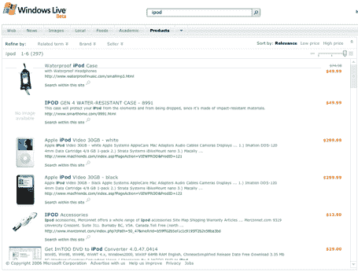
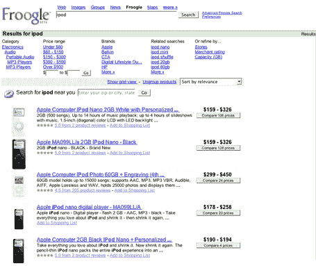

# 微软悄然推出 Froogle 竞争对手

> 原文：<https://web.archive.org/web/http://www.techcrunch.com:80/2006/05/05/microsoft-quietly-launches-froogle-competitor/>

  微软 Live 产品今天在[products.live.com](https://web.archive.org/web/20220810213931/http://products.live.com/)发布。他们包括了 10 万个卖家的零售产品。像 Froogle 一样，Live Products 是一个仅面向商业的搜索引擎/购物比较引擎，有望在用户寻求在线购买商品时提供更多相关结果。像 Froogle 一样，Live Products 不会因为出现在搜索结果中而向商家收取费用。

然而，Froogle 和 Live 产品之间有一个重要的区别。Froogle 通过推送模型从商家获取数据(商家使用 Froogle API 来包含信息)，而 Live Products 则从主要的 Live Search web 索引中获取数据——因此 Live Producst 提供抓取的结果和算法排名。如果商家不采取任何额外的步骤就在索引中，它们将被包括在内。

Live 产品还不如 Froogle，尽管这很大一部分可能是因为 Froogle 通过他们的推送模型从商家那里获得了非常结构化的数据。相比之下，实时产品直接构建数据。

比较在 [Live Products](https://web.archive.org/web/20220810213931/http://www.live.com/#q=%20%20%20ipod&scope=products&offset=1) 上搜索“iPod”与在 [Froogle](https://web.archive.org/web/20220810213931/http://froogle.google.com/froogle?q=ipod&btnG=Search+Froogle) 上搜索“iPod”的结果(两者的屏幕截图如下)。Froogle 几乎立即返回结果，而 Live Products 需要 2-4 秒才能在我的电脑上返回结果。Froogle 也只返回 iPod 的结果，而 Live Products 则包括附件，甚至将它们放在实际的 iPod 之上。最后，虽然这两种服务都允许用户通过品牌、卖家或相关术语来细化结果，但我喜欢谷歌将这些内容放在结果的顶部，而无需额外点击:这更容易被注意到(相比之下，Live Product 非常干净，但很容易错过下拉链接)，而且节省了一次点击。

Froogle 还包括用户对商家的评论，这在 Live Product 中处于规划阶段，但尚未发布。

不过，Live Products 确实有一些很棒的功能。他们直接从搜索索引中获取信息的事实意味着他们将拥有比 Froogle 更完整的数据。此外，我喜欢 Ajax 滑块，它控制每个结果返回多少信息(包括图像开/关)。我也喜欢按价格排序结果的能力，这是一种更好的方式来查看结果 v. Froogle 的按价格细化功能。

一些用户会喜欢使用实时产品进行电子商务相关的搜索。对于微软来说，解决这个群体是有意义的——在直播产品上投放的广告将比普通搜索上的类似广告更有针对性，因此也更昂贵。

目前还没有关于实时产品将如何与实时购物整合的消息。好消息是，与在线购物不同，Live Products 可以与 Firefox 兼容。

