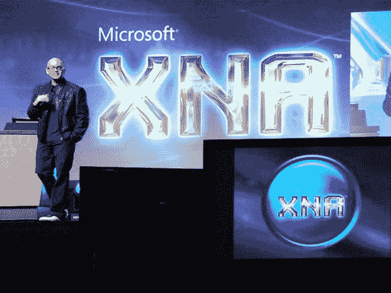

# 微软发布 XNA 游戏工作室快速测试版

> 原文：<https://web.archive.org/web/http://techcrunch.com/2006/08/30/microsoft-releases-xna-game-studio-express-beta/>

微软发布了 XNA 游戏工作室 Express 测试版，这是一款面向有抱负的游戏开发者的软件。该程序兼容 Windows XP 和 Windows Vista，所有在该软件上开发的游戏都可以在这个假期迁移到 Xbox 360 上，成为 XNA Creators Club 的一部分。问题是，XNA Creators Club 需要 99 美元的年费，或者 49 美元的四个月试用费。不算太寒酸，因为你将使用该软件创建 Xbox 360 游戏。用于在 Xbox 360 上构建和分发游戏的 XNA Game Studio Express 和 XNA Creators Club 的真实版本将在未来几个月内同时推出，而 XNA Game Studio Professional 将在 2007 年春季上市。

编辑:我不同意 Matt 的观点，我认为向为 Xbox 360 制作游戏的人收费有点愚蠢。微软可能会帮自己一个忙，让这个免费。它只是通过为用户提供更多的内容来吸引他们的控制台。我猜收费背后可能有一些逻辑，但这些费率似乎过高。也许这可以是一次性收费的事情。就目前的情况来看，这几乎就像用户为微软工作而被收费一样。不错的球拍。布雷克

XNA 游戏工作室快速测试版