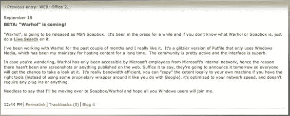
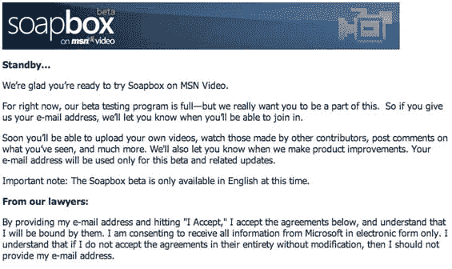

# 微软 SoapBox 刚刚推出 TechCrunch

> 原文：<https://web.archive.org/web/http://www.techcrunch.com:80/2006/09/18/microsoft-soapbox-to-launch-on-tuesday/>

# 微软 SoapBox 刚刚推出

  如今，了解微软新产品发布的最佳方式是阅读员工的博客。首先，我们看到了斯图尔特·帕德利(Stuart Padley)迅速删除的博客文章，其中有一些关于即将到来的微软 Live Drive(T4)的额外信息。

今晚我们听说 [Soapbox](https://web.archive.org/web/20220927212916/http://soapbox.msn.com/) ，一个类似 YouTube 的用户上传的视频产品，我们两周前[第一次听说](https://web.archive.org/web/20220927212916/http://www.beta.techcrunch.com/2006/09/09/microsoft-youtube-clone-coming/)，可能最早在明天发布。这个消息来自 Kurt Shintaku [的博客](https://web.archive.org/web/20220927212916/http://kurtsh.spaces.live.com/blog/cns!DA410C7F7E038D!1290.entry)。

有几个细节。测试注册页面称用户将能够上传你自己的视频，观看其他贡献者制作的视频，对你所看到的发表评论，等等 Om Malik 通过一个评论者说*“soap box 自动检测你的浏览器+平台，并为 IE/Windows 用户传输 WM，但 Flash 适用于 Firefox/Windows 和 Mac 上的 Firefox+Safari。”LiveSide 表示，最大 100 MB 的视频可以以 AVI、ASF、WMV、MOV、MPEG 1/2/4、3GPP、DV 文件格式上传。*

无论他们推出什么，都应该很有趣。与 Live Spaces(一个巨大的博客平台)的深度整合，本身就会推动大量的使用。

**更新:**[新闻稿](https://web.archive.org/web/20220927212916/http://www.microsoft.com/presspass/press/2006/sep06/09-18SoapboxBetaPR.mspx)刚刚在微软上发布。很少新信息。我们正试图获得一个测试帐户来做一个全面的审查。

