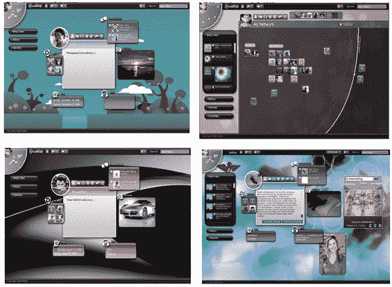

# 微软分拆 Wallop 发布

> 原文：<https://web.archive.org/web/http://www.techcrunch.com:80/2006/09/25/microsoft-spinoff-wallop-launches/>

  [Wallop](https://web.archive.org/web/20230223042546/http://www.wallop.com/) ，之前是[半被遗忘的](https://web.archive.org/web/20230223042546/https://techcrunch.com/2005/12/19/microsoft-wallop-in-user-trials/)微软研究“沙盒”社交网络和照片分享项目，今年早些时候被[剥离](https://web.archive.org/web/20230223042546/http://www.microsoft.com/presspass/press/2006/apr06/04-25WallopPR.mspx)成为一个新的、独立的、风险投资支持的业务([详情在此](https://web.archive.org/web/20230223042546/https://techcrunch.com/2006/04/25/microsoft-spins-off-wallop-project/))。加州时间今晚 9 点，Wallop 将推出一个半公开的测试版。

Wallop 是一个基于 Flash 的社交网络，它将与 Myspace、脸书和我昨天在一篇文章中提到的其他网站竞争。它包括供人们上传照片、视频和音乐的免费无限存储空间。

与其他社交网络不同，Wallop 首席执行官卡尔·雅各布(Karl Jacob)表示，他没有在网站上投放广告的计划。他说，这只会降低用户体验。相反，沃洛普希望从美国每年 3 万亿美元的自我表达商品(衣服、家具、美容用品等)市场中分一杯羹。).正如 Cyworld 这样的网站所显示的那样，人们也愿意为在线表情项目花钱(据报道，Cyworld 每天为其用户带来 30 万美元的微交易)。

因此，沃洛普在网站上创建了一个“自我表达”商品市场。Flash 开发人员可以创建项目并将其出售给用户。音乐剪辑、动画部件、艺术品、头像、头像服装等。将全部出售。沃洛普负责支付和数字版权管理，并抽取销售价格的 30%。剩下的归卖家。

市场功能仍在建设中，但沃洛普表示，他们将有能力为卖家创造一种物品的拍卖销售，限量版销售等。在不久的将来。

被邀请的用户将获得五个邀请，每个可以用来邀请其他人进入 Wallop。将根据用户在服务中的活跃程度向他们发出更多邀请。期待这项服务在 2007 年初离开测试版并向公众开放。

Wallop 总部设在旧金山，有 27 名员工。他们已经在两轮中从 Bay Partners、Consor Capital 和 Norwest Venture Partners 筹集了总计 1300 万美元的风险投资。

沃洛普的屏幕截图如下。

