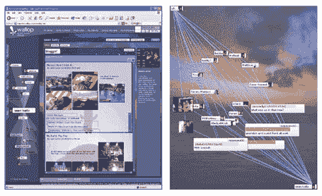

# 微软在用户试用中大获全胜 TechCrunch

> 原文：<https://web.archive.org/web/http://www.techcrunch.com:80/2005/12/19/microsoft-wallop-in-user-trials/>

# 微软在用户试用中大获全胜

我已经从用户那里听说了一点微软的 [Wallop](https://web.archive.org/web/20221129104912/http://mywallop.com/) 项目(显然它至少已经存在两年了)。微软将 Wallop 描述为一个“分享照片、博客和与朋友互动”的地方。好吧，这并没有缩小范围。

测试版已经关闭，正如我上面所说，网站上没有太多的描述性信息。微软[社交计算网站](https://web.archive.org/web/20221129104912/http://www.research.microsoft.com/scg/)有更多信息，包括一些截图:

> 在 Wallop，你可以分享照片，写博客，和朋友互动。Wallop 是一个研究项目，探索人们如何在社交网络的背景下共享媒体和建立对话。我们目前正在进行一个小型的真实世界的试验，由小型的友谊团体参与。因此，在试验结束之前，瓦勒普 http://mywallop.com 的会员资格仅限于研究参与者。

我会盯着这个的。社交计算网站[上的其他项目](https://web.archive.org/web/20221129104912/http://www.research.microsoft.com/scg/)看起来也很有趣。

