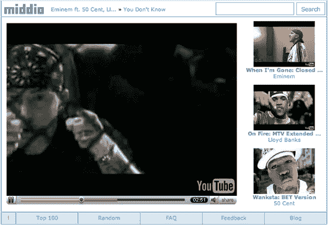

# middio:YouTube 的音乐视频搜索引擎——TechCrunch

> 原文：<https://web.archive.org/web/http://www.techcrunch.com:80/2007/04/22/middio-music-video-search-engine-for-youtube/>

# middio:YouTube 的音乐视频搜索引擎

Middio 是一个新网站，仍处于私人测试阶段，它从 YouTube 上检索音乐视频，并用艺术家和歌曲名正确标记它们。搜索界面不错；找到某个艺术家的音乐视频只需要一会儿时间，而且没有你在 YouTube 搜索中看到的无关内容。Middio 网站也嵌入了视频。

Middio 没有的是播放列表或任何收藏喜欢的视频的方式，这是 YouTube 的两个非常有用的功能。在他们添加之前，我会使用 Middio 作为快速搜索 YouTube 上的音乐视频的好方法，然后点击将它们添加到 YouTube 播放列表中。

另一个引人注目的功能是能够将视频转换成 iPod 格式并下载到电脑上。YouTube 将[尝试](https://web.archive.org/web/20220815074322/http://www.beta.techcrunch.com/2006/11/15/huh-youtube-sends-techcrunch-a-cease-desist/)阻止它，但不清楚他们是否合法。

Middio 将于 5 月 5 日发布。在主页上注册以获得电子邮件通知。