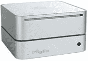

# Migilia TVMax+让您直接录制到 Apple TV、iPod | TechCrunch

> 原文：<https://web.archive.org/web/http://techcrunch.com/2007/03/16/migilia-tvmax-lets-you-record-right-to-apple-tv-ipod/>

如果苹果电视[有朝一日](https://web.archive.org/web/20160329015726/http://crunchgear.com/2007/03/14/appletv-shipping/)上市，你可能会考虑把它挂在 Miglia TVMax+上。当然，这个名字有点多余(Max plus？麦克斯就是不够好吗？)但它可以让你将有趣的内容直接录制到 5G iPod、Mac 或 Apple TV 上。它也是一个数字电视调谐器。想想类似 TiVo 的功能。支持的视频编码包括 MPEG-2、MPEG-4 和 Divx 我猜 h.264 对 Miglia 来说不够酷。它还不到 300 美元，对我来说太贵了，尤其是当你可以从你周围的备用硬盘上组装类似的设备。

[产品页面](https://web.archive.org/web/20160329015726/http://www.miglia.com/products/video/tvmaxplus/index.html)【Miglia via[iLounge](https://web.archive.org/web/20160329015726/http://ilounge.com/index.php/news/comments/miglia-intros-content-collection-hub-for-ipod-apple-tv/)