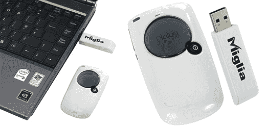

# 适用于 Mac 和 PC 的 Miglia 无线 VoIP 

> 原文：<https://web.archive.org/web/http://techcrunch.com/2006/09/07/miglia-wireless-voip-for-mac-and-pc/>

# 适用于 Mac 和 PC 的 Miglia 无线 VoIP

Migilia 发布了一款 2.4GHZ 的无线手机，可以在 Mac 或 PC 上工作。它没有显示屏，通过 USB 加密狗传输。该设置包括可以与 AIM、iChat AV、MSN 或 Skype 同步的软件，使其成为 VoIP 的多功能选项。

它的功能可能有点轻，但对于那些希望比简单地对着麦克风说话更隐私的人来说，这款设备似乎是一个不错的选择。现在售价 79 美元。

[产品页面](https://web.archive.org/web/20130627210659/http://www.miglia.com/products/communication/dialogphone/index.html)【via[Gizmodo](https://web.archive.org/web/20130627210659/http://gizmodo.com/gadgets/gadgets/miglia-dialog-phone-wireless-voip-for-mac-and-pc-199052.php)