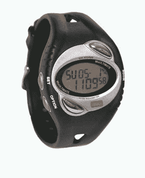
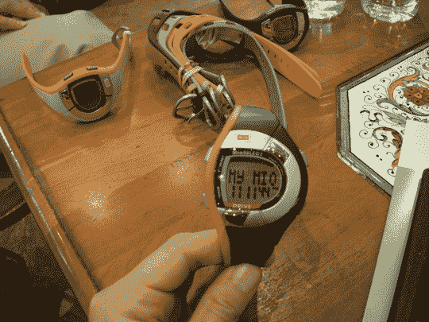
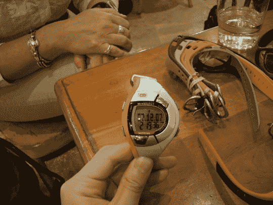
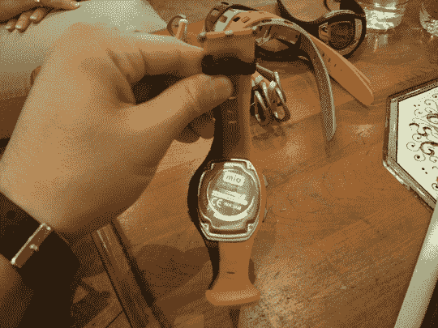
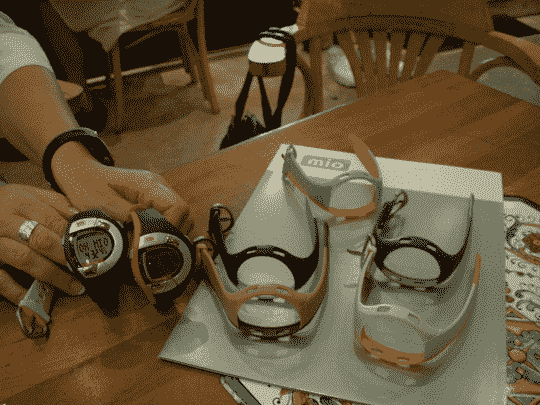

# Mio 希望你减肥，胖子

> 原文：<https://web.archive.org/web/http://techcrunch.com:80/2007/07/17/mio-wants-you-to-lose-some-weight-fatty/>

前几天，我有机会与 physical 的首席执行官 Liz Dickinson 坐下来，聊了聊 Mio 和他们即将推出的手表系列。Mio 系列不仅仅是另一个廉价心率监测手表系列，更是一个生活方式手表系列，希望让你保持健康，并在游戏中处于领先地位。我是一个健身房老鼠，希望今年最终保持身材，即使这会杀了我，所以即将到来的选择线让我坐立不安，就像一个五岁的孩子在等待浴室。

我们将从终极开始，因为过去几天我已经能够摆弄它了，到目前为止一切顺利。当它与随附的胸带结合使用时，我可以随时获得连续的心电图心率，因此我知道自己何时在燃烧脂肪或处于有氧运动范围内。它还可以计算锻炼过程中燃烧的卡路里和脂肪，显示最大心率的百分比，计算锻炼过程中的平均和整体最高心率，指示我何时处于目标心率区，显示高于/低于/处于目标心率区的时间，并测量该脂肪恢复到静止心率所需的时间。跑步手表的常见标准功能包括闹钟、日期、秒表、倒计时器、计圈器和一系列其他功能。我暂时就说到这里，因为我将在接下来的几周内进行全面的回顾。终极版目前售价 140 美元。

九月份上市的是微风、动力和动力。Breeze 是入门级的心电图心率监测手表，无需胸带即可在 ole ticker 上为您提供点播信息。它的主要功能包括根据您的年龄和性别计算的最大心率百分比，根据心率和个人数据显示您工作强度的视觉指示器，以及带有八圈记忆的秒表，闹钟，日期，报时和背光显示。

Drive 比 Breeze 更上一层楼，它可以计算您在锻炼过程中消耗的卡路里，具有 12 圈记忆秒表，具有双间隔倒计时定时器，最重要的是，3500 卡路里倒计时模式是专为 MIO 3500 卡路里倒计时计划设计的。简而言之，3500 卡路里倒计时表示你已经燃烧了足够的卡路里，3500 卡路里，可以燃烧一磅脂肪。很明显还有更多的东西，但那要等到全面审查，或者如果你超级渴望找到答案，那么[点击这里](https://web.archive.org/web/20150710192201/http://www.miowatch.com/3500/)。

Motiva 吸引了我的全部注意力，因为它是手表的一站式采购。Motiva 包含了其他手表的所有关键功能，并拥有大量其他功能，这将使你想知道为什么你现在只听说过 Mio。一个获得专利的卡路里管理系统可以让你根据每日卡路里目标跟踪你的卡路里摄入量和运动中消耗的卡路里。这一切都与 3500 CC 配合使用，包括五个双间隔计时器，用于 13 周的步行/跑步计划。这不仅仅是一个告诉你有多胖的手表，更是一个生活方式手表，它希望根据你的心率让你知道你的身体在做什么。还有比这更好的吗？我不这么认为。

这三款手表的防水深度均可达 30 米，电池寿命为 12 个月，可与所有 Mio 可互换表带配合使用，并且有一个漂亮的电池盖，让你可以更换电池，而不必担心破坏密封。微风零售价为 59 美元。这款硬盘售价 79 美元，会让你多花 20 美元。Motiva 只要 99 美元。

[绪](https://web.archive.org/web/20150710192201/http://www.miowatch.com/component/option,com_frontpage/Itemid,1/)