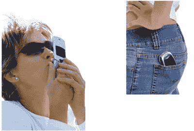

# Mobeam:带背光的条形码扫描？TechCrunch

> 原文：<https://web.archive.org/web/http://techcrunch.com/2007/03/01/mobeam-barcode-scanning-with-the-backlight/>

我从来不热衷于那些受移动解决方案提供商欢迎的“拍一张条形码的照片，然后买一张布兰妮的票”的计划，但这有点颠覆了整个概念。NTT DoCoMo 的流媒体移动应用提供商 [Ecrio](https://web.archive.org/web/20160407215557/http://www.ecrio.com/) 开发的 Mobeam 可以闪烁手机上的任何光源，模拟任何激光扫描仪的条形码。没错。沃尔玛的店员只需要扫描你的*手机*，就能从你的七喜上获得 50 美分的折扣。

这项技术没有签约的合作伙伴，它可能只是众所周知的移动潘中的一瞬间，但这是这种类型的少数几个项目之一，实际上激起了我的兴趣。如果你可以通过彩信甚至短信发送优惠券，在收银台刷一下手机，然后上路，想象一下零售产品的接受度，以及在某种程度上，优惠券裁剪节省的时间和精力。

显然，这项技术足以鼓励女性亲吻她们的乳房

再加上一些全球定位系统，你就有了一个真正的开始。现在，如果产品页面不只是一个 3 分钟的 flash 电影，也许我们可以得到一些可靠的信息。下周找一份对这些人的完整采访。

[移动光束](https://web.archive.org/web/20160407215557/http://www.ecrio.com/mobeam/)