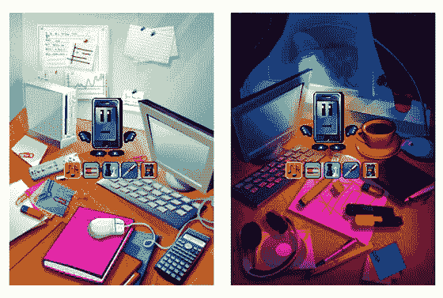

# mobile pet my phone:iPhone 的虚拟宠物

> 原文：<https://web.archive.org/web/http://www.techcrunch.com:80/2007/07/03/mobilepet-myphone-virtual-pets-for-the-iphone/>

 手机游戏门户 [Cellufun](https://web.archive.org/web/20160422003243/http://www.cellufun.com/) 发布了其最新游戏“MobilePet myPhone”，这是一款面向 iPhone 和其他手机用户的虚拟宠物游戏。

MobilePet myPhone 允许用户照顾、玩耍和喂养虚拟宠物。用户必须让虚拟宠物不生病，不感到被忽视，并且必须“避免去虚拟电脑商店修理”。MobilePet myPhone 用户可以从 Cellufun 的艺术家目录中下载音乐来娱乐他们的宠物。此外，当用户的朋友通过他们自己的电话访问他们的宠物时，以及通过成功地照顾他们的宠物，用户可以获得积分；分数与相同游戏社区中的其他成员进行比较，以在记分牌上获得一个位置。

这款游戏基于 WAP，支持广告，提供不需要下载的免费服务。

电子鸡和任天堂的任天堂狗的成功表明虚拟宠物游戏非常受欢迎。将这种狂热带到 iPhone 上似乎是合乎逻辑的一步。
