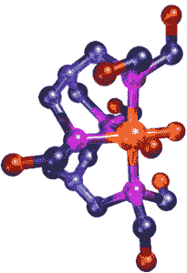

# 分子识别，即将推出——TechCrunch

> 原文：<https://web.archive.org/web/http://techcrunch.com/2006/09/05/molecular-identification-coming-soon/>

# 分子鉴定，即将推出

[MobileMagazine](https://web.archive.org/web/20201026013534/http://www.mobilemag.com/) 报道称，英国科学家开发了一种“基于分子”的 ID 标签——我猜从技术上讲，任何 ID 标签都是基于分子的，但我认为他们指的是分子大小。无论如何，这些新标签是通过一种被称为分子计算识别(MCID)的过程创建的，这种过程使用化学混合物迫使分子产生光。这些光发射显然可以被读取用于识别目的。

由于其尺寸，MCID 可用于各种医疗应用，例如监测人体内疾病的进展。他们假设 MCID 可以取代 RFID，但在我看来，潜在的用途是相当不同的。

[科学家宣布基于分子的身份标签](https://web.archive.org/web/20201026013534/http://www.mobilemag.com/content/100/313/C9377/)