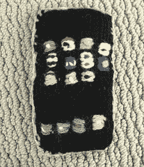
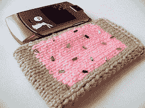

# 妈妈织了一部 iPhone

> 原文：<https://web.archive.org/web/http://techcrunch.com:80/2007/07/06/mom-knits-an-iphone/>

今天是星期五，你猜怎么着？iPhone 时间！今天我给你带来了一个由某个极客的母亲创造的针织 iPhone。细节是非凡的，所有可用的应用程序都可以在正面触摸，光滑的灰色/金属背面，当你可以得到这个时，你为什么还要买一个真正的 iPhone？

编织花了大约 5 个小时，你猜怎么着:这位妈妈甚至可以编织一个馅饼。是啊，草莓糖霜馅饼。我很确定这个有着热辣编织技巧的妈妈比一只能够从 2 Live Crew 的第一张混音带中说唱歌曲的秃鹰更重要。点击跳转查看流行馅饼。

[我妈手工编织了一部 iPhone](https://web.archive.org/web/20160515160524/http://daddytypes.com/2007/07/04/my_mom_handknit_an_iphone.php)

