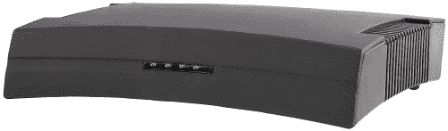

# 季风 HAVA 黄金，白金击中零售| TechCrunch

> 原文：<https://web.archive.org/web/http://techcrunch.com/2007/07/02/monsoon-hava-gold-platinum-hd-pvrs-hit-retail/>

HAVA 白金高清

季风的 HAVA 黄金和 HAVA 白金全功能视频流媒体设备现在可以通过弗莱的电子产品，TigerDirect.com 和全国其他选定的零售商。这些盒子允许你在任何地方通过宽带连接的电脑或手机(想想 Slingbox)观看和控制你的直播电视节目。HAVA 黄金的零售价为 129.99 美元，而白金高清为 159.99 美元。跳转后列出的全部功能。

季风 HAVA 黄金和白金高清功能:
–使用连接宽带的电脑或手机，在连接到家庭网络的电脑上或从世界任何地方观看和控制直播电视。
–连接到任何电视信号源，包括有线电视、卫星电视、DVD、TiVo 和摄像机
–同时向多台电脑组播视频
–Windows XP Media Center Edition 集成–显示为已安装的电视调谐器卡(仅 HAVA 白金高清版)
–在电脑上实现类似 TiVo 的功能。用户可以录制、存储、暂停、倒带和快进存储的视频(仅限 HAVA 白金高清版)
–安排和录制节目供以后观看(仅限 HAVA 白金高清版)
–允许将存储的内容刻录到 DVD(仅限 HAVA 白金高清版)
–所有输入都包括一个直通接口， 将 HAVA 连接到家庭视频设备时无需使用分割器
–以 MPEG-2 全 D1、720 x 480 像素全屏的方式将视频以平均 6 Mbps 的速度直接传输到家庭网络中的电脑
–组件输入和对原生 16:9 显示比例的支持——“支持高清”(仅限 HAVA 白金高清)
[白金高清](https://web.archive.org/web/20160422003132/http://www.myhava.com/product_hava_platinum_hd.html?Submit2.x=24&Submit2.y=5&Submit2=Learn+More)

[黄金](https://web.archive.org/web/20160422003132/http://www.myhava.com/product_hava_gold.html?Submit4.x=28&Submit4.y=11&Submit4=Learn+More)