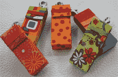

# Moo 卡便携包| TechCrunch

> 原文：<https://web.archive.org/web/http://techcrunch.com:80/2007/08/14/moo-card-carrying-cases/>

快速说三遍！如果你使用 Flickr，你可能很熟悉 [Moo](https://web.archive.org/web/20150626221824/http://www.moo.com/) 和他们用你的照片打印出来的可爱的小名片。问题是，这些名片与乔·布洛(或马特)递给你的标准名片形状不同。

所以如果你只依赖 Moo 卡(或者不依赖)，为什么不弄个合适的便携包呢？这些漂亮的盒子可以在 Etsy 的 Splatgirl 上以 11 美元一盒的低价买到。必须物有所值。Moo 迷你卡每 100 张售价 20 美元。斯宾塞。

[为你的 Moo 迷你卡准备的漂亮口袋](https://web.archive.org/web/20150626221824/http://www.popgadget.net/2007/08/pretty_pocket_f.php)