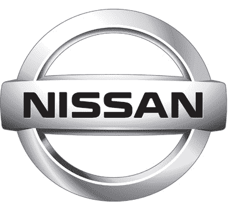

# 日产提供更多安全帮助:事故预防系统| TechCrunch

> 原文：<https://web.archive.org/web/http://techcrunch.com/2007/08/07/more-safety-help-from-nissan-accident-prevention-system/>

尼桑想要根除的不仅仅是酒驾，而是普遍的鲁莽驾驶。一个新的系统将在年底前首次亮相，将帮助司机避免事故。该系统考虑到了你的车和你前面的车之间的距离，速度和恶灵的存在。

例如，如果你在应对前方的驾驶危险时迅速将脚从油门踏板上移开，汽车将自动启动刹车。(我以为摔上一跤是坏事？或者那只是在打滑的时候？)

当个人责任足够时，所有这些技术。

[一些新的日产汽车会警告撞车](https://web.archive.org/web/20170226195308/http://www.boston.com/business/globe/articles/2007/08/07/some_new_nissans_will_warn_of_crashes/)【AP/Boston . com via[clave](https://web.archive.org/web/20170226195308/http://crave.cnet.com/8301-1_105-9756027-1.html?part=rss&tag=feed&subj=Crave)