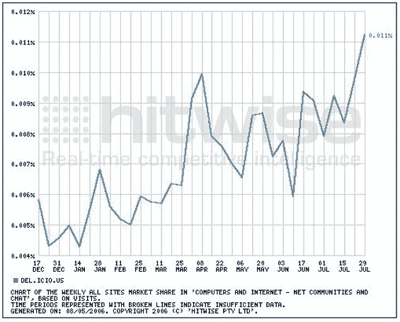

# 更多关于 Del.icio.us 的数据，这次是正面的

> 原文：<https://web.archive.org/web/http://www.techcrunch.com:80/2006/08/04/more-stats-on-delicious-this-time-positive/>

  这是我今天早些时候写的关于 del . icio . us的帖子的更新，据康姆斯克称，该网站的流量大幅下降，Alexa 的流量持平。

今天下午，我与 del.icio.us 创始人约书亚·夏科特(Joshua Schacter)以及搜索产品副总裁埃卡特·沃尔特(Eckart Walther，约书亚的老板)和雅虎搜索公关经理梅丽莎·里舍(Melissa Rische)进行了交谈。他们给了我一些 del.icio.us 的雅虎内部数据，以对抗 comscore 的数据。我还得到了一张有用的 del . icio . us traffic independent 的点击率图表，也在下面。

Del.icio.us 表示，康姆斯克在衡量 del.icio.us 方面存在“严重缺陷”，并称“实际数据全面大幅上升”。具体来说，他们说:

*   今年，页面浏览量、使用量和新注册量逐月增长了至少 10%
*   Del.icio.us 的日注册量、日发帖量和活跃月独立用户数都创下了历史新高
*   到目前为止，del.icio.us 上已经创建了超过 5300 万个帖子(在 2500 万个 URL 上)，自[收购](https://web.archive.org/web/20220818162851/http://www.beta.techcrunch.com/2005/12/09/yahoo-acquires-delicious/)以来，帖子增长了 250%

他们还提到，他们已经从收购时的 20 台服务器增长到今天的 100 多台，任何新功能发布的缺乏都是由于从传统的 del.icio.us 平台迁移到 Yahoo MyWeb 平台。

因此，总的来说，他们描绘了一幅健康、不断增长的服务的画面，与我所能找到的大多数公开可用的统计数据形成了鲜明的对比。

我今天还设法为 del.icio.us 获得了一些 Hitwise 数据。见下面的图表显示市场份额与“计算机和互联网-网络社区和聊天”。这并没有增加太多，但至少显示了这类公司的市场份额在稳步增长。

在这个过程的最后，在审查了公开数据(有很大缺陷，但中立)和雅虎内部数据(可能是准确的，但有选择地披露)后，我得出结论，我不知道 del.icio.us 发生了什么。

我最担心的不是康姆斯克是否无法完美地衡量观众，而是他们方法中的缺陷是否会随着时间的推移而波动，从而导致不可靠的趋势和比较。至少，他们的数据应该比 Alexa 显示的数据更具统计相关性和准确性。看来，至少对 del.icio.us 来说，情况并非如此。