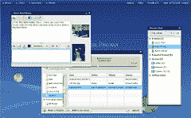

# Mosoto:在脸书 TechCrunch 上分享文件和聊天

> 原文：<https://web.archive.org/web/http://www.techcrunch.com:80/2007/02/07/mosoto-share-files-and-chat-on-facebook/>

# Mosoto:在脸书上共享文件和聊天

 脸书[去年发布了一个 API](https://web.archive.org/web/20221209140848/http://www.beta.techcrunch.com/2006/08/15/facebook-requests-developer-friends-with-new-api/) ，新创公司 [Mosoto](https://web.archive.org/web/20221209140848/http://mosoto.com/) 很好地利用了它。Mosoto 是一个 Flex 2.0 应用程序，它通过 API 位于你的[脸书](https://web.archive.org/web/20221209140848/http://crunchbase.com/company/facebook)账户之上，允许你共享文件、与朋友聊天以及发现新朋友。该应用程序有一个桌面布局，在这里您可以控制不同的迷你应用程序来共享文件、聊天、发现朋友和共享音乐。

聊天客户端控制大部分活动，列出你加入了哪些脸书朋友、朋友的朋友和脸书网络。通过将鼠标悬停在名字上，Mosoto 会提醒您个人资料之间的相似之处。如果你发现某个人看起来很有趣，你可以和他交朋友，然后通过聊天窗口把他介绍给你。聊天是一对一的，和一群朋友，甚至是一个网络中的所有朋友。

 在聊天名册中，您可以使用免费的 1GB[Box.net](https://web.archive.org/web/20221209140848/http://www.beta.techcrunch.com/2006/10/23/boxnet-announces-funding-registered-users/)帐户与您的朋友分享文件。您可以使用浏览器内的文件列表和文件查看器来共享和打开图片、歌曲和视频等文件。Mosoto 最有趣的文件共享类型是音乐。Mosoto 可以让你将歌曲上传到你的 Box 帐户，并把它们串在播放列表中，你的朋友可以播放和混音。音乐播放器列出了所有的音乐和你朋友的列表，并允许你将朋友帐户中的歌曲混合到你自己的播放列表中。

Mosoto 希望在三月中旬发布，但仍在通过他们的[脸书小组](https://web.archive.org/web/20221209140848/http://www.facebook.com/group.php?gid=2230455480)进行测试。该项目是自筹资金，由亚利桑那大学的五名应届毕业生组成的团队创建的:吉拉德·凯利、塞斯·莱斯基、路易斯·陈、斯里尼瓦桑·钱德拉塞卡兰和钟保罗。

请观看下面的视频，了解该产品的概况，并播放有史以来最廉价的背景音乐。