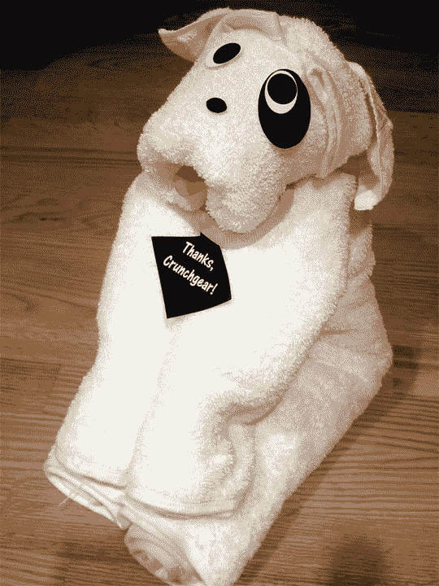

# 母亲节 iPod 赠品:OMG 哇！TechCrunch

> 原文：<https://web.archive.org/web/http://techcrunch.com/2007/05/09/mothers-day-ipod-giveaway-omg-wow/>

啊，我没想到它，但是看起来像你们在最后一分钟一起拉它。我们将在美国东部时间中午 12:00 结束报名，然后我会公布参赛者，只是为了好玩，并随机挑选两名参赛者，这样我可以确保在周日之前将这些照片交到你们手中。这里是规则，重述一下。

拿出 MS Paint，给你的妈妈画一张卡片，然后一起发送，伙计们。我甚至取消了“投票”部分，将在美国东部时间明天中午随机选出一个获胜者。为了公平起见，我将从三个“实体”参赛者中挑选一个，而不是“虚拟”参赛者，以确保他们有更大的胜算。请继续阅读完整的细节。

好了，伙计们。还有六天就是母亲节了，而你却没有任何东西送给你妈妈。百思买赠送的 iPod Nano 和一些巧克力怎么样？接下来会发生什么。我有两个 iPods 放在这里，为了确保它们能及时出去给妈妈买一个，我需要在美国东部时间 5 月 9 日星期三下午 12:00 之前报名，我们将投票到美国东部时间 5 月 10 日星期四下午 12:00。那天下午我会把 iPods 运出去，希望它们能在 5 月 13 日周日之前到达。你需要做什么才能赢？

你必须让妈妈/你签名。(妻子、女朋友、婴儿妈妈)母亲节的其他礼物。它可以是一张用回形针粘着的纸，上面写着“坦克妈妈！”或者一张写着“我爱你”的建筑用纸，我们不在乎，只要它是一件原创的艺术品，无论是实物还是虚拟的。拍张照片，发到 crunchgear dot com 上，主题是“MUDDA”在物品上的某个地方写上“谢谢，嘎吱嘎吱”的字样，这样你就不会只是翻垃圾，然后发一张你 1975 年在 sleepaway 营地做的东西的照片。

我们将在周四公布参赛者并投票。我们将对创意和酷感进行投票，前两名参赛者将能够从通心粉雕塑升级到炽热的 iPods。如果我们没有得到至少 10 个参赛者，我将取消比赛，所以告诉你所有的朋友和关系。

特别感谢百思买的令人愉快的，让妈妈快乐的纳米。