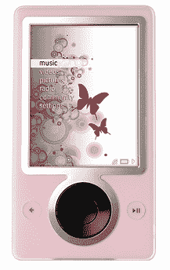

# 母亲节 Zune 大赛:加油！TechCrunch

> 原文：<https://web.archive.org/web/http://techcrunch.com/2007/04/28/mothers-day-zune-contest-come-on/>

加油，伙计们！免费的 Zunes？给你妈妈的？那就像给小猫的免费冰淇淋！请把那些参赛作品寄来，否则你妈妈会很不高兴的。我们现在就给他们打电话。说真的…听到铃声了吗？请继续阅读，了解你的妈妈是如何获胜的。

> 对于那些已经发来图片和故事的人，请保持下去。你们都是可怕的人类，理应获胜。对于你们其余的人，[你们应该知道我们正在进行另一场比赛](https://web.archive.org/web/20160421073011/http://crunchgear.com/2007/04/25/your-mom-wants-a-pink-zune/)。你在左边看到的是限量版的粉色 Zune。我们要把一辆全新的送给你妈妈。妈妈喜欢的东西，既然母亲节快到了，为什么不给她一件她会喜欢的东西呢？你赢了这场比赛，这个 Zune 就是你的了。
> 
> 谁有最讨厌的妈妈谁就赢了。我们想要一张照片和一个理由，说明她为什么会喜欢像全功能媒体播放器这样的东西。最好的三个条目将由 CrunchGear 的读者投票选出。来吧，马克杯，这比你去年给她买的巴黎希尔顿品牌的香水好多了。叫什么来着，有钱的荡妇？
> 
> 将你的参赛作品以“我的妈妈想要一个 Zune！”为主题发送到 crunchgear . com 的 *[竞赛比赛将于 5 月 1 日结束，届时我们将公布前 3 名，进行为期 3 天的投票。然后我们会宣布获胜者，会有很多欢乐。](https://web.archive.org/web/20160421073011/mailto:contest@crunchgear.com)*
> 
> 祝你好运！