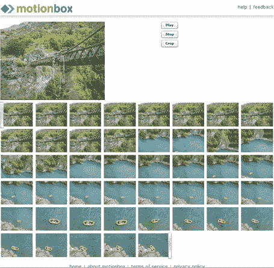
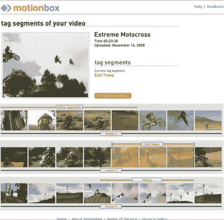

# motion box——迄今为止最好的在线视频分享技术

> 原文：<https://web.archive.org/web/http://www.techcrunch.com:80/2006/04/02/motionbox-best-online-video-sharing-so-far>

  自从去年 11 月我写了一篇关于在线视频领域公司的对比文章([flicks of Video](https://web.archive.org/web/20220906221507/http://www.beta.techcrunch.com/2005/11/06/the-flickrs-of-video/))以来，在线视频领域发生了巨大的变化。

有些事情没有改变:Flickr 仍然没有发布视频产品，YouTube (TechCrunch 发布[这里](https://web.archive.org/web/20220906221507/http://www.beta.techcrunch.com/tag/YouTube/))仍然是在线视频的卫冕冠军，只有[巨大的流量增长](https://web.archive.org/web/20220906221507/http://www.alexaholic.com/youtube.com+flickr.com)和关注份额。

但是新工具的出现使得在线分享视频变得更加容易。 [Video Egg](https://web.archive.org/web/20220906221507/http://www.videoegg.com/) 和 [Grouper](https://web.archive.org/web/20220906221507/http://www.grouper.com/) (TechCrunch 贴[此处](https://web.archive.org/web/20220906221507/http://www.beta.techcrunch.com/tag/Video-Egg/)和[此处](https://web.archive.org/web/20220906221507/http://www.beta.techcrunch.com/tag/grouper/))都有可下载的客户端，允许编码在桌面上闪烁(节省用户上传非常大的文件到服务)和一些非常基本的编辑功能。Grouper 还允许用户将多个视频文件串在一起(VideoEgg 还不允许这样做)。此外，虽然在桌面上工作比在线容易，但您必须安装软件。Grouper 在 Mac 上不可用。VideoEgg 有一个可以在 Safari 上运行的 Mac 客户端，但是我无法把它安装到我新买的基于 Intel 的 Mac 上。

将在未来几周推出的新服务 [Motionbox](https://web.archive.org/web/20220906221507/http://www.motionbox.com/) 远不止这些。上周，首席执行官克里斯·奥布莱恩和投资人德里克·伊德莫托过来向我演示了这项服务，嗯，我印象深刻。

Motionbox 没有 Grouper 和 VideoEgg 那样的客户端上传器。您必须将完整的视频文件上传到该服务。虽然这些上传很痛苦，但 Motionbox 有很好的理由这样做。

要了解 Motionbox 在做什么，拿一个 YouTube，添加大量非常棒的编辑、混搭和深度标签功能。像 YouTube 一样，Motionbox 将文件转码为 flash，以减小文件大小和标准化观看。但它们也存储原始文件，并允许您或您授权的人下载这些文件和/或购买带有这些文件的 DVD。

## 编辑和混搭

我也有机会测试 MotionBox 的视频编辑工具。在编辑视频时，Motionbox 会将视频直观地分解成帧(见上面的截图)。用户可以广泛地编辑文件，包括链接几个视频文件和删除文件的任何部分。使用这个编辑特性，还可以创建与其他用户的公共或共享视频的混搭。坦率地说，这远远超出了其他任何人正在做的事情，包括 VideoEgg 和 Grouper 目前的产品。所有这些更改都可以推回到原始质量的文件，以供下载或 DVD 刻录。

## 深度标记

像 YouTube 和其他服务一样，Motionbox 允许对视频文件进行标记。但是他们也允许*对部分视频文件进行深度标记*。打开一个文件(见上面的截图)选择视频的一部分，并标记它。观众稍后可以通过点击标签直接跳到该视频片段。较长的视频现在可以很容易地分解成可链接的片段。相对于竞争对手的服务，这是一个巨大的飞跃。

Chris 没有给出多少关于定价和文件大小限制的细节，只是说任何限制都是基于时间和文件大小的，就像 YouTube 一样(它有 100 mb 的文件大小限制)，许多或所有限制将对高级用户解除(预计每年 25 美元的高级订阅费)。

在这里注册以获得 Motionbox 发布[的通知。](https://web.archive.org/web/20220906221507/http://www.motionbox.com/)