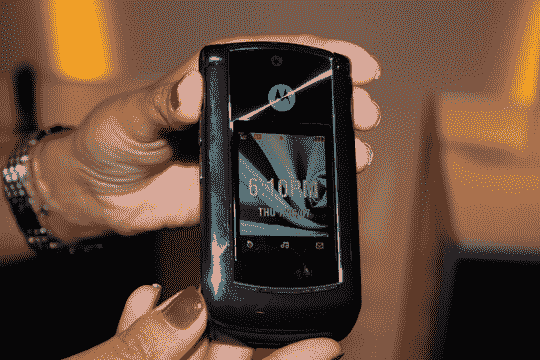
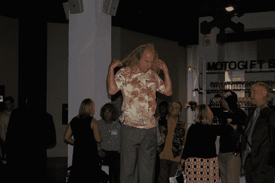

# Moto RAZR2 亮相威瑞森无线:如此强大的 LCD 

> 原文：<https://web.archive.org/web/http://techcrunch.com:80/2007/08/10/moto-razr2-debuts-on-verizon-wireless-such-a-powerful-lcd/>

大肆宣传的摩托罗拉·拉兹尔今天在威瑞森无线电台首次亮相。它将带有所有焦点小组测试的 VZW 功能，我从来没有使用过，如 V-Cast 音乐下载和 VZ 导航 GPS。所以服务就像你期待的那样来自威瑞森。在这里，这意味着所有主要运营商中通话质量最好的，但你不得不忍受 VZW 手机瘫痪的习惯。

另一方面，几周前我和彼得玩 RAZR2 的时候，它还好好的。正面的触摸感应 LCD 控制着手机的几乎所有功能:打电话、播放音乐等等。我甚至在活动中开玩笑说，RAZR3 只是一个液晶面板，你可以用 RAZR2 控制所有的事情。是的，我是零分。

除此之外，它拥有像这样的大众市场手机应该拥有的一切:A2DP 蓝牙，这样你就可以通过蓝牙耳机听音乐，200 万像素的摄像头(我想我们最终可以告别 130 万像素的摄像头)…

她签了两年的合同，要价 300 美元，有点贵。但是成为这个街区第一个拥有新款 RAZR 的孩子并不是免费的。

哦，加拉格尔也在摩托车活动上。是的，[那个加拉格尔](https://web.archive.org/web/20160512085246/http://youtube.com/watch?v=oI8QxKTw59Q)。去想想。

[威瑞森无线](https://web.archive.org/web/20160512085246/http://www.verizonwireless.com/b2c/index.html)

[威瑞森在美国正式推出 razr 2](https://web.archive.org/web/20160512085246/http://www.electronista.com/articles/07/08/10/moto.razr2.reaches.verizon/)【Electronista】
[运营商](https://web.archive.org/web/20160512085246/http://crave.cnet.com/8301-1_105-9758312-1.html)