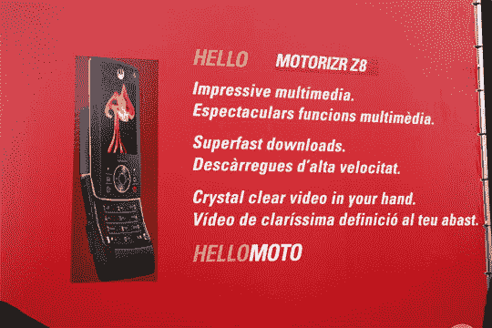

# 摩托 RIZR Z8:多媒体 RIZR | TechCrunch

> 原文：<https://web.archive.org/web/http://techcrunch.com/2007/02/12/moto-rizr-z8-mulitmedia-rizr/>

今天早上刚走到展览场地，我看到了什么？摩托化 Z8，一款充满多媒体魅力的升级版 RIZR。根据我的简单检查，这似乎是一款 3G-HSPDA-GSM 手机，主要吸引人的是视频和音乐。我现在要去摩托罗拉的展位，所以我会给你更多的信息。

它应该会在 4 月份在欧洲上市——可能在 2110 年在美国上市？