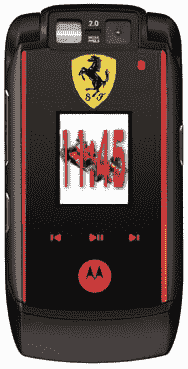

# 摩托罗拉和法拉利宣布冗长的手机名称，实际手机

> 原文：<https://web.archive.org/web/http://techcrunch.com:80/2007/01/26/motorola-and-ferrari-announce-lengthy-phone-name-actual-phone/>

# 摩托罗拉和法拉利宣布冗长的手机名称，实际电话

摩托罗拉，你只是在你这个星期的比赛伙计！你一直在泄露像《荒野大镖客》一样的东西[,现在你发布了一款与法拉利合作的新手机？有什么独家新闻，老兄？](https://web.archive.org/web/20210417131712/http://crunchgear.com/2007/01/24/leaked-motorola-investors-document-shows-off-slew-of-new-products/)

原来摩托罗拉今天推出了新的 **RAZRmaxx V6 法拉利挑战赛手机限量版**。它不仅拥有有史以来最长的手机型号名称，还包含来自法拉利 F1 赛车的声音、特殊的法拉利照片和壁纸、专用音乐按钮、HSDPA、200 万像素摄像头和前置 VGA 摄像头。

法拉利和摩托罗拉将于 1 月 29 日以 635 美元/€490 美元的价格在全球发布这款手机(这是一个好举措)。这是一部不错的手机，但就这个价格而言，只有法拉利车迷才需要申请。

[摩托罗拉筹备法拉利版 RAZRmaxx](https://web.archive.org/web/20210417131712/http://www.electronista.com/articles/07/01/26/moto.razrmaxx.ferrari/)