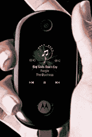

# 摩托罗拉·PEBL:我们能再试一次吗？TechCrunch

> 原文：<https://web.archive.org/web/http://techcrunch.com/2007/07/13/motorola-pebl-can-we-try-this-again/>

# 摩托罗拉·PEBL:我们能再试一次吗？

摩托罗拉 PEBL 实际上很酷。在手机棱角分明、平板、毫无吸引力的一年里，声音洪亮、有机的 PEBL 就像是你在独家水疗馆放在背上的东西。相反，它的用户界面和 RAZR 一样乏味，对渴望免费手机的大众来说不够棱角分明、扁平和缺乏吸引力。

所以我们来到了 ROKR U9，这是 ROKR 音乐播放手机家族中一款类似 PEBL 的设备，有着光滑的外壳和类似 PEBL 的线条。凝视它，你就能看到真相&mdash，大女孩不哭。没有可用性或价格。

[摩托罗拉将 PEBL 加入 ROKR 阵容](https://web.archive.org/web/20130628200250/http://www.phonescoop.com/news/item.php?n=2286)