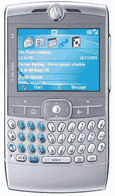

# 摩托罗拉 Q 加入 Sprint 阵容| TechCrunch

> 原文：<https://web.archive.org/web/http://techcrunch.com/2007/01/04/motorola-q-joins-sprint-lineup/>

这不是什么惊天动地的消息，但摩托罗拉 Q 已经正式加入了 Sprint 的设备阵容。Sprint 的版本包括访问其 Powerdreck 门户网站、EV-DO 宽带及其 Power Vision 网络、NFL 移动新闻和更新以及大量新内容。

除此之外，在 NFL 的交易上还是老一套。聪明的举动，我相信 Sprint 的每个足球爱好者都会喜欢它。定价应该在 200 美元左右，Sprint 的 Q 将于 2 月份上市。

Sprint 将摩托罗拉·Q 加入阵容