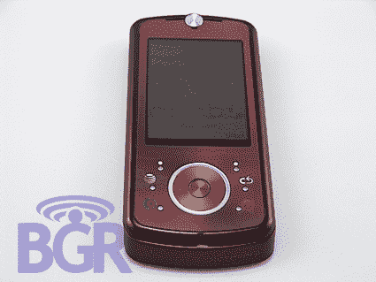

# 摩托罗拉 RIZR Z9 泄露——TechCrunch

> 原文：<https://web.archive.org/web/http://techcrunch.com:80/2007/07/07/motorola-rizr-z9-leaked/>

看看这个来自摩托罗拉的新奇的滑块。这款手机的运动风格让人想起 Razr 2，3G 数据，2MP 摄像头，以及 microSD 卡形式的可扩展性。尽管这款手机看起来非常时尚，但它只是一个原型，所以预计未来会有修改。所有的美国电话电报公司品牌，所以也许这东西会在接下来的几个月里取代 iPhone 的宣传。也可能不是…

[摩托罗拉 Z9 亮相！你能感觉到吗？哼哼？](https://web.archive.org/web/20201123191304/http://www.boygeniusreport.com.nyud.net:8080/2007/07/07/motorola-z9-unveiled-can-ya-feel-it-huh-huh/)【BGR】