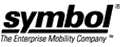

# 摩托罗拉将收购 Symbol Technologies

> 原文：<https://web.archive.org/web/http://techcrunch.com/2006/09/19/motorola-to-acquire-symbol-technologies-2/>

摩托罗拉今天宣布将以 39 亿美元收购 Symbol 科技公司。此举将使 Moto 成为全球最大的手持式条形码扫描仪销售商。

这两家公司多年来一直保持着密切的关系，因此这并不令人感到意外。然而，这次收购可以增强摩托罗拉的实力，帮助他们从诺基亚手中夺取手机市场的主导权。Symbol 生产用于 POS 和仓库系统的重型设备，他们的大多数产品都可以从摩托罗拉的无线专业技术中受益，而 Moto 的产品则可以放在 symbol 的硬壳箱中。看起来赢了赢了。