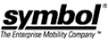

# 摩托罗拉将收购 Symbol Technologies

> 原文：<https://web.archive.org/web/http://techcrunch.com/2006/09/19/motorola-to-acquire-symbol-technologies/>

# 摩托罗拉将获得符号技术

摩托罗拉今天宣布将以 39 亿美元收购 Symbol 科技公司。此举将使 Moto 成为全球最大的手持式条形码扫描仪销售商。

这两家公司多年来一直保持着密切的关系，所以这并不令人感到意外。然而，这次收购可以增强摩托罗拉的实力，帮助他们从诺基亚手中夺取手机市场的主导权。