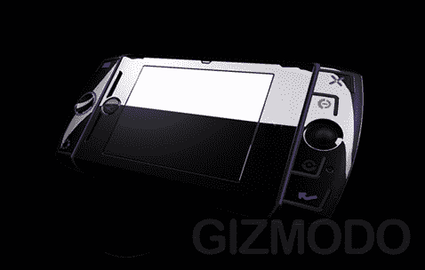
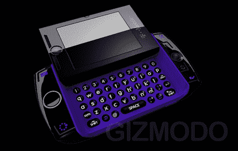
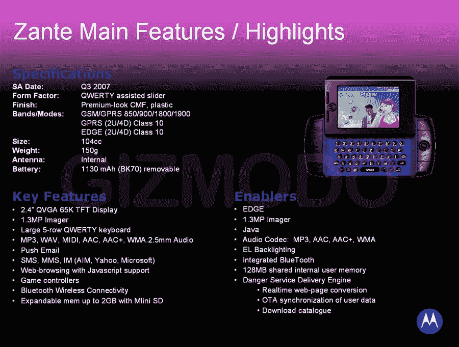

# 摩托罗拉·赞特又名 Sidekick Slide 又名 Sucks | TechCrunch

> 原文：<https://web.archive.org/web/http://techcrunch.com/2007/07/04/motorola-zante-aka-sidekick-slide-aka-sucks/>

Gizmodo 有关于最新助手的独家新闻，但有一些明显的迹象表明这可能都是假的。让我们看看你是否能认出他们。如果这一切都是真实和准确的，那么我讨厌这样说，但最新的助手对我来说绝对没有任何作用，我相信它对你也不会有太大的作用。当然，外表看起来很闪亮，有着黑色和紫色的配色方案，但内部却没有给我留下一点印象。Q900 正在考虑 10 月份推出，但我非常怀疑这是真正的 Sidekick Slide/4/Zante。指出所有不准确的地方，我会看看有什么奖励。成交？

[摩托罗拉·赞特看起来比你认识的人还要光彩照人，也紧张不安](https://web.archive.org/web/20151003193029/http://gizmodo.com/gadgets/zhiny/motorola-zante-looks-even-shinier-than-you-know-who-also-runs-on-edge-274943.php)