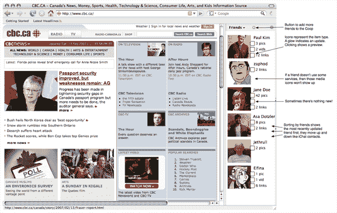

# Mozilla 将社交网络嵌入 Firefox:对 Flock 来说是个坏消息

> 原文：<https://web.archive.org/web/http://www.techcrunch.com:80/2007/04/03/mozilla-to-build-social-features-into-firefox-bad-news-for-flock/>

# Mozilla 将社交网络嵌入 Firefox:对 Flock 来说是个坏消息

Mozilla 发布了 Coop 的细节，这是一款将社交网络功能直接整合到 Firefox 浏览器中的新产品。这对私人支持的社交浏览器来说不是一个好消息，该浏览器尚未发布 1.0 版本。许多提议的功能和 Mike Beltzner 创建的一些模型(见上文)表明这两种产品有很大的重叠。

事实上，Coop 甚至在 [wiki 页面](https://web.archive.org/web/20210918232927/http://wiki.mozilla.org/Labs/The_Coop#Initial_Wireframes)上有一个描述该产品的 Flock 示例屏幕截图，以及描述“该设计可能会类似于(以前的 Flock)克里斯·梅西纳的“浏览器中的人”模型，有一个水平栏包含用户朋友的头像，图标覆盖在这些头像上以指示新内容的存在。”

Coop 产品将允许 Firefox 用户在浏览器中“订阅”朋友，将这些朋友带入侧边栏。这些朋友可以与您共享内容和网页(从您那里接收内容，并向您发送内容)。

添加好友意味着可以访问他们发布的大量网络内容。内容将从该人的 Flickr 照片源、del.icio.us 标签源、MySpace 状态、YouTube 收藏夹等中提取。当你想与用户分享内容时，你只需把它拖到他们的头像中(见下面的模型)。

正如 Larry Dignan 指出的那样，Coop 也可能对依靠不断刷新用户页面来维持浏览量增长的社交网络产生影响。在浏览器中直接显示朋友的状态信息可以大大减少直接访问这些网站的需要。