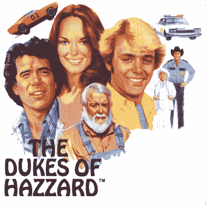

# 美国电影协会当场抓住斯汀:该死的杜克小子！TechCrunch

> 原文：<https://web.archive.org/web/http://techcrunch.com/2007/07/05/mpaa-caught-red-handed-in-sting-durn-them-duke-boys/>

我知道这件事昨晚不胫而走，但也挺搞笑的。美国电影协会雇佣了一家名为 MediaDefender 的公司来阻止盗版。他们是怎么做到的？通过一个叫 MiiVi 的假视频下载网站，一个全是红热视频的红热下载网站。有什么问题吗？它让你下载间谍软件，报告在你的电脑上发现的被盗视频。多好的款待啊！

世人是如何发现这个诡计的？[白痴](https://web.archive.org/web/20160422005333/http://www.mediadefender.com/)用他们自己的名字和地址注册了域名。

我已经说过一次了，我还要再说一次——这些笨拙的努力是如此令人厌恶的透明和愚蠢，以至于它反映了一个行业的糟糕表现，到目前为止，这个行业的表现就像一群白痴。我喜欢一些电影，我在 iTunes 上给自己买一些电影，但这就像看格格巫试图压扁蓝精灵，这让我想下载一些[的红色热门电影](https://web.archive.org/web/20160422005333/http://www.thepiratebay.org/)。

美国电影协会媒体卫士建立“假”网站抓捕盗版者

海盗湾希望 MediaDefender 走上破产之路