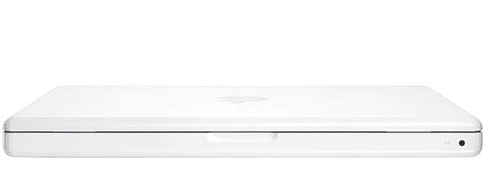

# 10 月份 MacBooks 上的多点触控

> 原文：<https://web.archive.org/web/http://techcrunch.com:80/2007/06/29/multi-touch-on-macbooks-in-october/>

# 10 月份 MacBooks 上的多点触控

早在 6 月 20 日，我就报道过[将于 10 月推出新款、更轻薄的 MacBooks】，除了采用新材料制造之外，还将对内部组件进行一些“速度和反馈”更新。今天，另一个“可靠消息来源”告诉我们这是正确的，并补充说，iPhone 的多点触摸技术理论上应该与所有新的笔记本电脑一起推出，包括 10 月份推出的笔记本电脑。该功能将内置于触摸板中，允许您浏览笔记本电脑的文件、应用程序等。就像在 iPhone 上一样。(是的，我知道你已经可以用它们滚动了，这没什么新鲜的。我说的是所有其他可以在 iPhone 屏幕上完成的手指手势。)](https://web.archive.org/web/20201126020741/http://crunchgear.com/2007/06/20/rumor-macbooks-slim-down-in-september/)

没有理由相信苹果不能增加这一功能，这肯定会是一个很好的补充。只要用它来浏览你的 iTunes 资料库，放大照片、文档或网站就很棒了。希望这能实现。