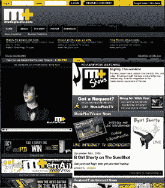

# MusicPlusTV 很酷…我觉得| TechCrunch

> 原文：<https://web.archive.org/web/http://www.techcrunch.com:80/2006/12/14/musicplustv-is-cool-i-think/>

 [音乐加电视网](https://web.archive.org/web/20160126094700/http://musicplustv.com/) (MusicPlusTV)是 80 年代的 MTV:有趣、年轻，实际上是关于音乐的。这是一个在线音乐视频/音乐会站，于 2005 年 6 月推出。本周早些时候，他们宣布了一轮七位数的融资和许可协议，这引起了我们的注意。

MusicPlusTV 是一个节目网络，每个节目都有自己关注的流派。它让我想起了很多 [D7TV](https://web.archive.org/web/20160126094700/http://www.techcrunch.com/2006/12/06/d7tv-may-be-the-next-mtv-for-mobile-content/) ，只不过 D7TV 不是以音乐为中心的，它针对的是移动市场。MusicPlusTV 是电脑屏幕上的音乐内容。

这些节目在预定的时间进行直播，这样观众就可以[瞄准](https://web.archive.org/web/20160126094700/http://www.techcrunch.com/tag/AIM/)视频请求。

MusicPlusTV 的发言人布莱恩·金(Bryan Kim)说:“事实上，AIM 是让观众参与我们几乎所有节目的一个非常重要的工具。“我们会让观众发即时消息，点播视频，向客人提问，等等。来自世界各地，这是我们进行直播的一个重要原因——为了互动性。”

节目在浏览器中流式传输到 Windows Media Player。Kim 说，MusicPlusTV 的目标是广播新乐队和主流乐队的混合体。Snoop Dogg 最近为该公司做了一个电台 id，其他工作室嘉宾包括侏罗纪 5，活着的传奇，Jon B，亚洲星球，Blackalicious，等等。他们在网站上还有几个独家的音乐会片段。

“我想说我们倾向于引入更多的音乐，”金说。“但最重要的是提供一个前 40 名的平衡，你可以在广播电台、MTV 等有限的播放列表中找到。”

Kim 表示，该公司每月的点击量接近 100 万次，但他不会给出确切的用户数量，也不会透露该公司从 Kenai Investment LLC 获得了多少资金。

周三，MusicPlusTV 宣布与 [Windows Media Guide](https://web.archive.org/web/20160126094700/http://www.windowsmedia.com/MediaGuide/Home) 、 [Akimbo](https://web.archive.org/web/20160126094700/http://www.akimbo.com/) 、 [Tvext](https://web.archive.org/web/20160126094700/http://www.tvext.tv/) 和 [Globe7](https://web.archive.org/web/20160126094700/http://www.globe7.com/) 达成协议，通过各自的网站分发 MusicPlusTV 节目。

这是我见过的最酷的音乐视频网站之一，但我不得不承认这些类型都不是我喜欢的音乐。我不消费几乎如此时髦的内容，但如果我这样做了，我会给这个网站充分的支持，因为它组织良好，生产价值高，流是干净的，节目有大量的音乐内容，而不是一些 VJ 谁想要聊他们自己的生活。如果我很酷，我肯定会说这家公司很酷。