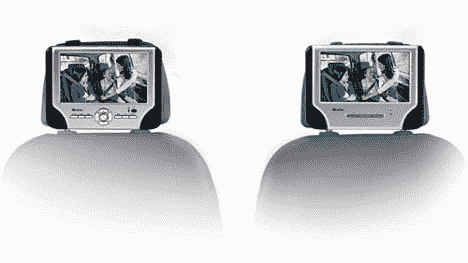

# Mustek 的双屏便携式 DVD 播放器| TechCrunch

> 原文：<https://web.archive.org/web/http://techcrunch.com/2006/10/05/musteks-dual-screen-portable-dvd-player/>

# Mustek 的双屏便携式 DVD 播放器

这些东西对我来说仍然完全陌生。当我还是个孩子的时候，我的父母会开车带着我和我的朋友们到处逛，我们经常假设在后座上玩电子游戏和看电影的能力。我想这总是不可避免的，但当时似乎是不可能的。

无论如何，对今天的孩子来说，这是一个现实。我想他们现在希望的不是便携式游戏，而是一个可接受的视角。穆斯泰克已经把他们搞定了。这款新系统采用双 7 英寸 TFT 显示屏，480 x 234 像素，能够显示 16:9 宽屏。

该播放器可以播放 CD 和 DVD，MP3，DivX，XviD 和 AVI。它有一个杜比数字解码器。它的售价约为 230 美元。

 [Mustek PD77 双屏 DVD 播放器](https://web.archive.org/web/20130627214300/http://www.techdigest.tv/2006/10/mustek_pd77_two.html)【科技文摘 via [UberGizmo](https://web.archive.org/web/20130627214300/http://www.ubergizmo.com/15/archives/2006/10/mustek_pd77_dualscreen_dvd_player.html)