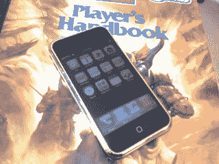

# 我的 iPhone 周末:太棒了，以后还有空间

> 原文：<https://web.archive.org/web/http://techcrunch.com/2007/07/03/my-weekend-with-iphone-it-kicks-ass-with-room-to-kick-more-later/>

具有讽刺意味的是，有些公司靠生产一款又一款蹩脚的手机谋生，然后像苹果这样的人进来向他们展示这是怎么做的。iPhone 可能会不负众望，但它并不完美。还没有。

我已经用了大半天 iPhone 了。它于上午 9:41 到达克朗彻格总部。我是那种在周六中午前几乎处于昏睡状态的人，但当我听说联邦快递的人在门口时，我很兴奋。我知道他给了我什么，我已经等了很久了。我跑到前门，看到一个苹果公司的盒子，上面写着我的名字，旁边是一个刻薄的联邦快递员。不管怎样，他不会毁了我的一天。

从那以后，我做了所有你能做的事情，我很高兴地说，它做的事情往往做得很好。可悲的是，有些老手机可以做的事情，iPhone 根本就没有尝试过。界面是梦想成真，这是毫无疑问的。在手机范围内，这是一种使用的乐趣，没有任何学习曲线，任何稍微熟悉电脑的人都无法在瞬间征服。在过去的两天里，我已经把它交给了几个第一次使用的用户，让他们完成一项任务，经过一些初步的熟悉和紧张之后，没有人遇到问题。

说到苹果的核心业务，可以说 iPhone 是一款扎实的 musicphone，可能是我用过最好的。iPod 程序实际上应该被称为 iTunes，因为它更类似于桌面实现，而不是便携式硬件。Coverflow 运行速度快，完美无缺，尽管如果你的歌曲或专辑没有列在 iTunes 封面数据库中，它就没有那么有吸引力了。你不一定要用，但我无法想象有人不想用。

照片应用程序是最基本的，但它很有效。传统上，照片应用和相机应用是合二为一的，而在这里它们是分开的。就我个人而言，我喜欢一键访问我的相机。当我的朋友做傻事时，我不想告诉他们“保持那个姿势！”当 5-00 随时可能出现的时候，iPhone 就会送来。这些照片不是很好，是典型的现代照相机。然而，他们比大多数人都要好，这很了不起。我最担心的一个问题是缺少闪光灯。iPhone 面向 20 多岁的年轻人，他们年轻时尚。年轻人和时髦的人经常在黑暗的酒吧里，而黑暗的酒吧需要相机有闪光灯。希望 2.0 版能解决这个问题。再说一次，这是我个人的偏好，但是高端手机往往有这个功能。你的手机有视频功能吗？这个没有。

iPhone 2.0 版本将解决这个问题的想法是我今天经常说的一句话，因为 iPhone 并不完全是它可能成为的样子。除了没有闪光灯，这款手机只有 2.5G，这意味着它比市场上同等价格的任何手机都慢。我知道我不是第一个听到你抱怨的人，但这是一个不容忽视的明显的疏忽。

 [https://web.archive.org/web/20130628195714if_/http://www.youtube.com/embed/RUFsyQpWETk?version=3&rel=1&fs=1&showsearch=0&showinfo=1&iv_load_policy=1&wmode=transparent](https://web.archive.org/web/20130628195714if_/http://www.youtube.com/embed/RUFsyQpWETk?version=3&rel=1&fs=1&showsearch=0&showinfo=1&iv_load_policy=1&wmode=transparent)

视频

除了缓慢的网络速度和平庸的摄像头处理，我不希望任何人除了偶尔发短信之外还能使用 iPhone。大多数手机都允许你编写一条信息并同时发送给几个联系人。iPhone 允许你一次给一个人发送一条信息。我不能这样生活。当我在移动时，这是所有的时间，我必须保持我的团队更新我目前的位置。一次发送一条信息，而不是 5 条、6 条或 26 条，会严重占用我的社交时间。这应该可以通过一个简单的固件升级来解决，因为我肯定不是唯一一个有这个问题的人，我在未来会看到它。这是另一个个人偏好的问题，但也是苹果选择不包括的低端手机上常见的另一个功能。

哦，一次一条短信不能包括照片或视频。因为如此高科技，你会认为 iPhone 可以发送彩信，但它不能。

你知道我们喜欢抱怨 CDMA 运营商削弱了他们手机上的蓝牙功能吗？iPhone 也是这样，这太糟糕了。我有很多带蓝牙的 Mac 电脑，我不能通过蓝牙把照片从 iMac 传到 iPhone，这种想法毫无意义。

 [https://web.archive.org/web/20130628195714if_/http://www.youtube.com/embed/vxTm4Nd6Opw?version=3&rel=1&fs=1&showsearch=0&showinfo=1&iv_load_policy=1&wmode=transparent](https://web.archive.org/web/20130628195714if_/http://www.youtube.com/embed/vxTm4Nd6Opw?version=3&rel=1&fs=1&showsearch=0&showinfo=1&iv_load_policy=1&wmode=transparent)

视频

这是坏的，但好的可能会超过它。除了是一个出色的音乐设备，网络浏览功能也很棒。只有一个词可以形容它，“太棒了”。Safari 的多点触控是无需鼠标和键盘浏览网页的最直观的方式，我发现自己想知道它在我的移动生活中去了哪里。即使在“极度缩小”的情况下，我也可以浏览页面并找到我要找的东西。该浏览器提供了其他人无法企及的移动网络浏览器的圣杯:多重浏览会话。Firefox 和 Safari for desktops 有选项卡(和其他浏览器)。iPhone 上的 Safari 有多个可滚动的窗口。我真的无法描述它们是如何工作的，但值得一试。

页面渲染速度相当快，并且具有完整的格式，这是一个非常好的特性。虽然缺少一些更高级的功能，但您不会错过它们。它只是工作。

较小的小工具应用程序也很棒。天气和日历快，正是你要找的，同样可以说是股票和计算器，甚至笔记。我个人认为它们应该被打包在一个更大的应用程序中，但是，嘿，我不姓乔布斯。

我们了解的最后一个 iPhone 大应用是 YouTube，它非常棒。视频在屏幕上看起来棒极了，部分原因是令人惊叹的光学硬件，但我们将深入探讨这一点。在 H.264 中，搜索效果很好，视频加载速度也很快。据说这个问题会在初冬前解决，所以无论如何都不会出现在负面清单上。

谷歌地图有点棘手。虽然不涉及 GPS，但很容易管理。任何使用过 Palm OS 版本的人都会发现很容易找到自己的路。事实上，这可能太简单了:当我在西雅图的家中时，我不知道在哪里输入搜索词。原来这是我曾经找到西雅图的地方。我完全期待一个单独的搜索框，但我总是认为事情会变得更难。它又快又准，对一些人来说，这可能是将他们推向 iPhone 阵营的足够理由。

因此，我们已经完成了许多功能，这是意料之中的。然而，iPhone 真正吸引人的地方不仅仅是它有多容易绕过这些功能(确实如此)，而是它们所呈现的诱人包装。

从设计角度来看，iPhone 不是全垒打，而是轰动一时。除了上面提到的所有功能，它还可以在美国电话电报公司的 GSM 网络上进行语音通话。我们从其他博客上听到了关于打一个简单的电话是多么痛苦的大惊小怪。这些人一定是白痴。虽然没有打开翻盖那么快，但解锁手机还是小菜一碟。点击电话图标，你就设置好了。iPhone 的做法我找不出毛病。

不过，销售它的是硬件。任何看到 iPhone 运行的人都会开始垂涎三尺，这是只有苹果才能产生的嫉妒和欲望。手机就是感觉对。尺寸和形状都很完美，屏幕巨大而明亮，即使在阳光直射下也是如此(这是西雅图一个美好的周末)。重量很结实。不重，但结实。在我的拼写检查中没有其他的形容词了。

说到屏幕，它有点容易弄脏，但任何手机都一样。我不明白为什么有些人对它的工作方式不满意。

苹果确实从智能手机 Treo 系列借用了一样东西:流行的铃声静音开关。它在这里和在掌上手机上一样受欢迎，是电影中的救命稻草。

毕竟，iPhone 并不完美，但作为第一次尝试，它表现出色。有一些失误，但没有什么是苹果无法解决的。我遇到的大多数问题都是因为我是一个手机用户。我喜欢大多数人不会使用的成熟功能，通常是复杂的智能手机形式。因此，iPhone 的第一个版本不适合我。但是如果你生活在 RAZRs 或 Samsungs 或其他普通手机的世界里，那么 iPhone 会让你大吃一惊。即使你是一个经验丰富的手机势利者，你也不能忽视 iPhone 的大多数方面都领先于其他任何人，在所有改变行业的方面，我们都期待苹果公司。

看看 iPhone。不要害怕它。直到你得到一个，它才变得有吸引力。虽然不是每个人都适合，但最终会的，但很有可能现在就适合你。