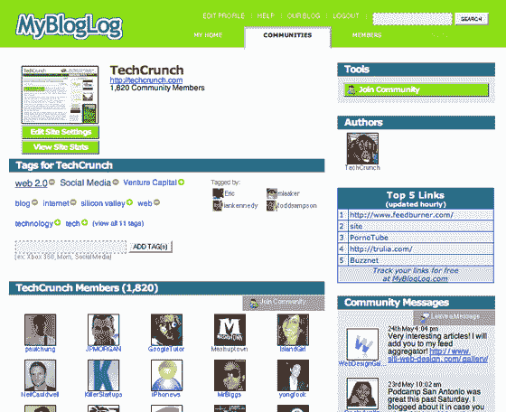

# MyBlogLog 进入标签领域

> 原文：<https://web.archive.org/web/http://www.techcrunch.com:80/2007/05/24/mybloglog-gets-into-tagging/>

今年早些时候被雅虎收购的分布式社交网络[MyBlogLog](https://web.archive.org/web/20220816075815/http://www.beta.techcrunch.com/2007/01/08/yahoo-buys-mybloglog-no-they-didnt-wait-yes/)将于今晚晚些时候推出标签功能，允许用户在服务上为人们和博客(称为“社区”)添加描述性标签。

创始人埃里克·马库利耶今晚告诉我，这项新功能有多种用途。主要用途是对主题和人物进行分类，让用户找到他们可能感兴趣的新内容。如果你阅读了某个博客，查看它的 MyBlogLog 页面([我们的在这里](https://web.archive.org/web/20220816075815/http://www.mybloglog.com/buzz/community/TechCrunch/))，点击一个标签就可以看到其他用相同单词标记的博客。

该公司还要求用户通过用“SchMOe”这个词标记垃圾网站来帮助打击垃圾邮件，他们说这个词代表“社交媒体优化器”(Schmoe)。该小组将审查这些标签和相关网站，并采取适当的行动。

任何用户都可以向任何其他用户或博客社区添加标签。一旦一个标签被添加，其他人可以投票支持或反对它，从而增加或减少它在云中的大小。简档的所有者可以永久删除任何标签。该公司正在从 Del.icio.us 和 Technorati 为博客导入标签，以获取初始内容；他们说，随着时间的推移，他们还会增加其他来源。

这项新功能是基于一个雅虎内部工具，由卡梅隆·马洛在他们的伯克利研究中心开发，名为 Tagsona。雅虎员工使用 Tagsona 在内部标记同事(听起来很有趣)。

MyBlogLog 继续扩张。Marcoullier 表示，他们正在追踪拥有 MyBlogLog 小工具的网站的 1 亿月度访客，该网站拥有 14 万注册用户。他说，就在最近，没有博客的人(仅限读者)开始注册的人数超过了有博客的用户。

这项服务将在今年晚些时候被重新设计，并可能被重新命名为 T8。