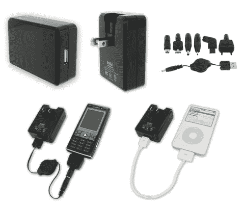

# myCharger 为你的 iPhone、iPod 和其他手机供电

> 原文：<https://web.archive.org/web/http://techcrunch.com:80/2007/07/02/mycharger-powers-your-iphone-ipod-and-other-mobile-phones/>

# 我的充电器为你的 iPhone，iPod 和其他手机供电

当我带着我所有的小玩意旅行时，旅行的技术爱好者会理解我所经历的痛苦。我带着三部手机、一台笔记本电脑、一台 iPod 和一台数码相机到处旅行已经够糟糕了，但加上充电器，它最终变成了一堆垃圾，多出来的几磅重量会带来很大的不同。Tekkeon myCharger 可能不会完全减轻重量和杂乱，但它肯定会为那些拥有多部手机的商务人士消除几个充电器。myCharger 是一款便携式 USB 电源适配器，带有可伸缩的插脚，并附带多个适配器，可满足您的大多数手机需求。

包装包括 USB 电源适配器、可伸缩 USB 电缆、迷你 USB 电缆、LG 适配器尖、两个诺基亚适配器尖、三星和索尼爱立信适配器尖。如果你是一个拥有 iPhone 和 iPod 的疯子，我的充电器会帮你搞定。只需通过 USB 插入，您就可以立即充电。您还可以为 5V 设备购买额外的适配器接头，如 PDA、PMP、MP3 播放器、蓝牙耳机和国际旅行包。只需 24.95 美元，所有这些都是你的了。趁供应不足，赶快买吧！

[产品页面](https://web.archive.org/web/20130628145019/http://www.tekkeon.com/site/products-mycharger.php)