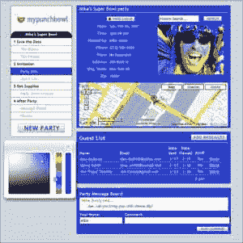

# MyPunchbowl 加入 eVite 枪手

> 原文：<https://web.archive.org/web/http://www.techcrunch.com:80/2007/01/14/mypunchbowl-joins-the-evite-gunners/>

# 我的拳击碗加入了艾维特枪手

 正值超级碗赛季，总部位于波士顿的 [MyPunchbowl](https://web.archive.org/web/20220522120407/http://mypunchbowl.com/) 邀请所有人来看看他们新的 eVite 竞争对手。一段时间以来，eVite 一直被视为竞争的成熟目标，因为用户继续抱怨不断的提醒电子邮件将该服务变成了 eSpam。

有一份服务清单已经在排队，准备接受这位网络老手的所有 Ajaxy 荣耀。 [Renkoo](https://web.archive.org/web/20220522120407/http://www.beta.techcrunch.com/2006/04/28/renkoo-beeta-launches/) 、 [Skobee](https://web.archive.org/web/20220522120407/http://www.beta.techcrunch.com/2006/03/09/skobee-just-launched-so-start-using-it/) 和 [Socializr](https://web.archive.org/web/20220522120407/http://www.beta.techcrunch.com/2006/09/13/socializr-in-private-beta-zzzzzzzz/) 是我们已经介绍过的几个。Renkoo 和 Skobee 通过整合活动前的活动规划阶段而脱颖而出，MyPunchbowl 也做了同样的事情。

MyPunchbowl 通过创建一个工作流模型，在每一步都提供了大量的控制，从而对派对计划采取了更严格的方法。每场派对都以保存日期或完整邀请开始，并一直进行到派对结束后的信息。在整个过程中，您和您的客人可以在聚会留言板上聊天，向一些或所有客人发送更新，重新编辑过程的任何步骤，并完全管理 RSVP 状态。

保存日期使用 Plaxo 支持的联系人导入程序，通过电子邮件将活动的基本细节(内容和地点)发送给您的朋友。邀请函确定了日期/时间和宾客名单，包括地图。这两个邀请都可以根据颜色和活动照片进行定制(带有嵌入式 Flickr 照片搜索)。与其他服务不同，MyPunchbowl 有个性化的 RSVP 消息，允许以一种比样板更好的方式邀请你的客人。它没有其他服务漂亮，但肯定会随着时间的推移而改变。

在你映射了你的事件后，一个聚会商店定位器会指出几个聚会商店链。像旅游规划网站一样，货币化将很可能通过与商店和其他方服务的附属交易来实现。

聚会后阶段允许成员在静态 URL 上分享照片，并就活动进行聊天。在未来，派对后阶段也将包括评级和推荐，这将通知其他派对参与者。不仅能够策划聚会，而且能够从其他聚会策划人的经验中学习，这将是聚会策划中一个有吸引力的特点，也是选择我的 Punchbowl 而不是其他产品的有力理由。